## Часть A. Установка и переключение домена

### 1. Composer и PHP-расширения
Установлен Composer глобально, расширения `mbstring, xml, bcmath, curl, mysql, zip` активны.

**Скриншот:**  
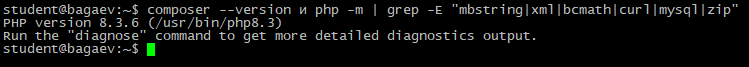

### 2. Переезд папок
`/var/www/boardy-legacy` — старый проект, `/var/www/boardy` — новый Laravel 11.

**Скриншоты:**  
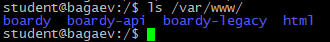  
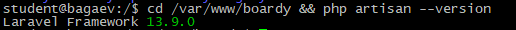

### 3. Структура Laravel
- **app/** – ядро приложения (модели, контроллеры, policies)
- **routes/** – файлы маршрутизации (web.php, api.php)
- **resources/views/** – Blade-шаблоны
- **database/** – миграции, фабрики, сидеры
- **public/** – точка входа (index.php) и публичные ресурсы (CSS, JS)

**Защитный вопрос:** *Почему document_root nginx должен указывать на `public/`, а не на корень Laravel?*  
Чтобы не было доступа к файлам типа .env с важной информацией, чтобы нельзя было получить к ним доступ.

### 4. Nginx-конфиг
Обновлён `root /var/www/boardy/public`, добавлен `try_files`.

**Скриншоты:**  
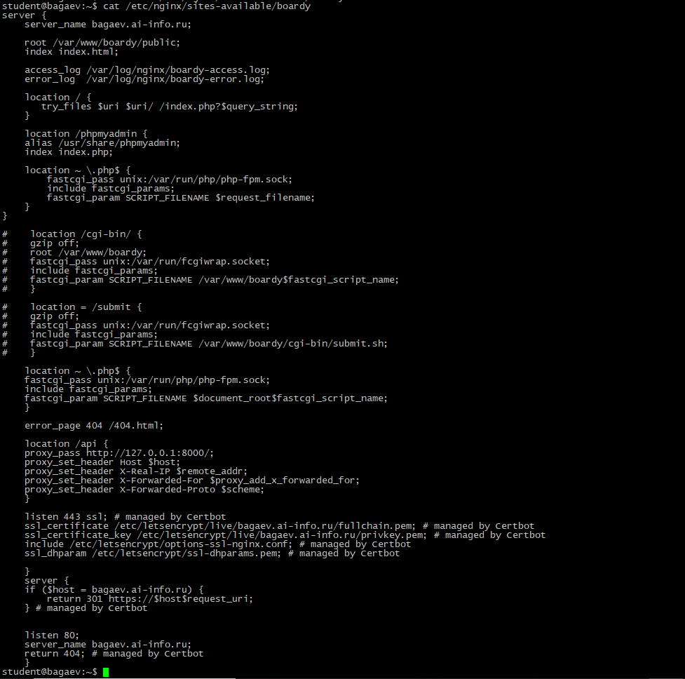  
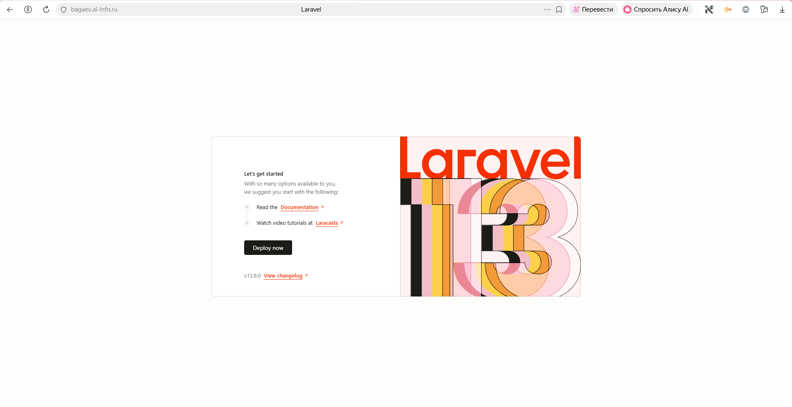

**Защитный вопрос:** *Что делает `try_files $uri $uri/ /index.php?$query_string`? Что без неё при заходе на `/posts/3`?*  
Проверяет, существует ли файл $uri или папка $uri/, и если нет отправляет в index.php. Без этой строки Nginx попытается найти файл /posts/3 и выдаст ошибку 404, и до роутера Laravel не дойдёт, поэтому красивые URL перестанут работать.

---

## Часть B. БД, миграции, сидер

### 5. Создание БД `boardy_main`
Создана БД с `utf8mb4`, пользователь `boardy` получил права.

**Скриншот:**  
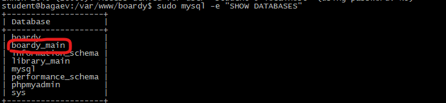

**Защитный вопрос:** *Зачем новая БД, а не подгонка старой?*
Легче новую сделать, чем старую под laravel подгонять

### 6. Подключение Laravel к БД
Настроен `.env`, `tinker` показывает PDO.

**Скриншот:**  
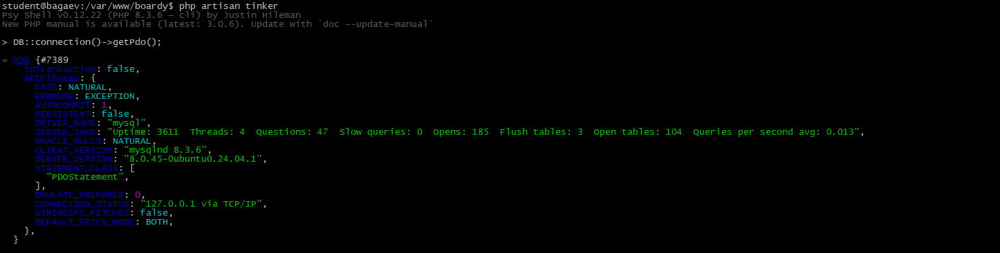

### 7. Миграции `posts` и `comments`
Созданы миграции, накатаны.

**Скриншоты:**  
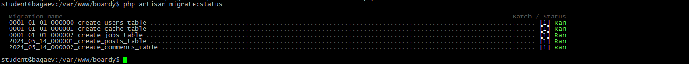  
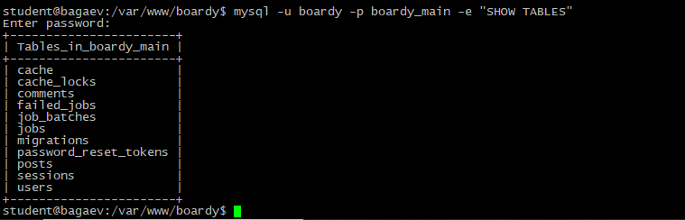

### 8. Модели со связями
У `User` добавлены `hasMany(Post::class)`, `hasMany(Comment::class)`. У `Post` – `belongsTo(User::class, 'author_id')` и `hasMany(Comment::class)`. У `Comment` – `belongsTo(User::class)` и `belongsTo(Post::class)`.

**Скриншот:**  
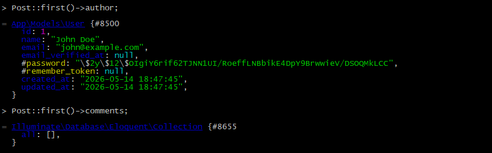

### 9. Сидер
Фабрики `PostFactory` (100 записей), `CommentFactory` (200), сидер создаёт 5 пользователей, каждому посты, к каждому посту комментарии.

**Скриншот:**  
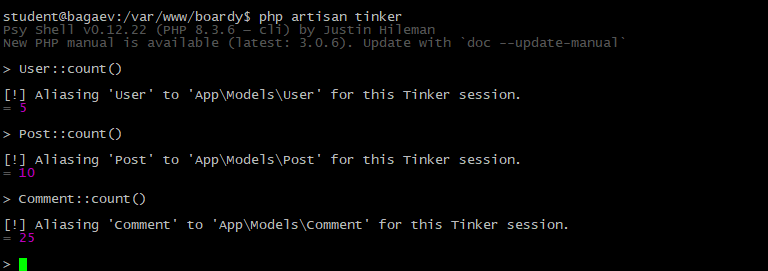

---

## Часть C. CRUD постов и комментариев

### 10. Маршруты
`Route::resource('posts', PostController::class)` и `Route::post('/posts/{post}/comments', [CommentController::class, 'store'])->middleware('auth')`.

**Скриншот:**  
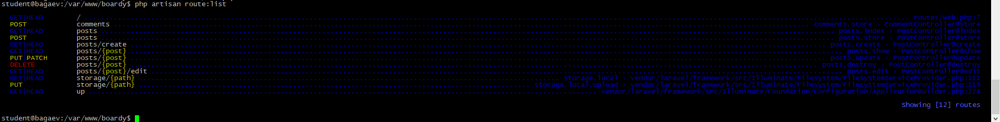

### 11. Лента постов
`PostController@index` пагинирует 10 постов, каждый с автором и датой.

**Скриншот:**  
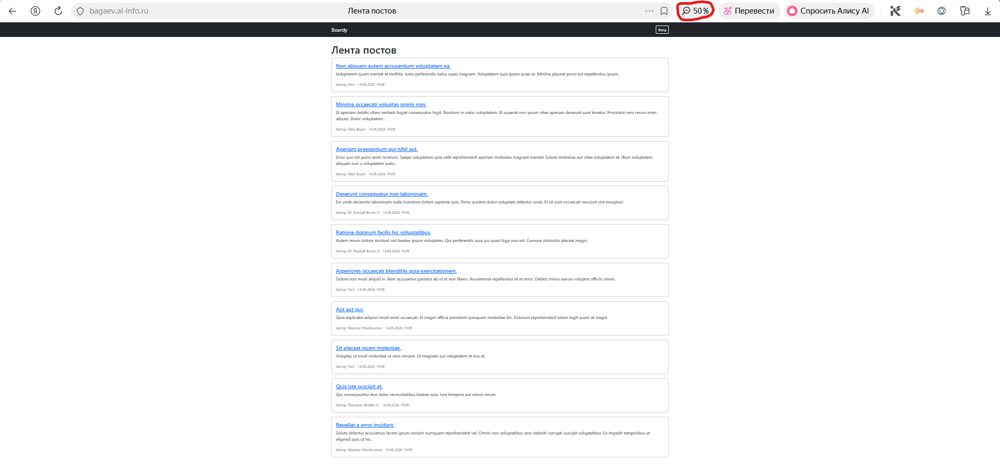

### 12. Страница поста с комментариями
`PostController@show` передаёт пост, комментарии (с авторами) и форму нового комментария для авторизованных.

**Скриншот:**  
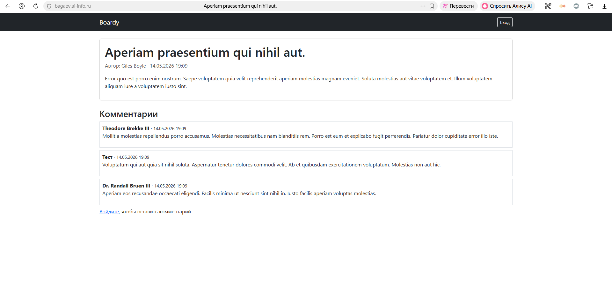

### 13. Создание поста
Форма `create`, валидация `title|required|min:5`, `body|required|min:10`. После сохранения – редирект на страницу поста.

**Скриншоты:**  
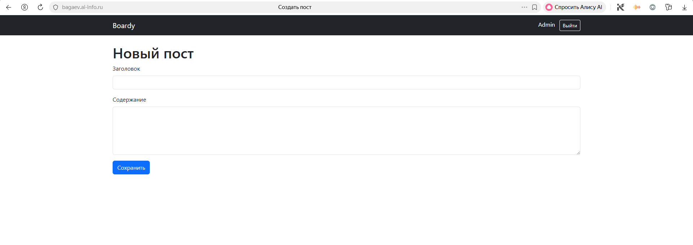  
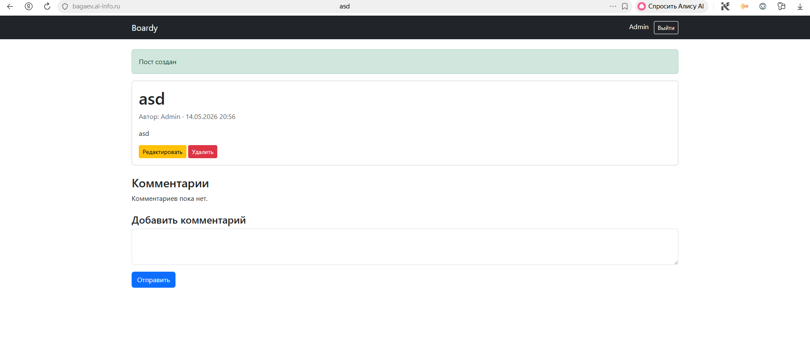

### 14. Policy и редактирование
`PostPolicy` с методом `update`. В контроллере `$this->authorize('update', $post)`. В Blade `@can('update', $post)` показывает кнопки.

**Скриншоты:**  
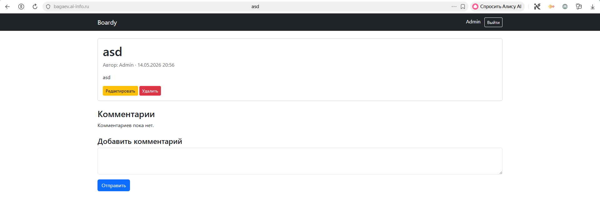  
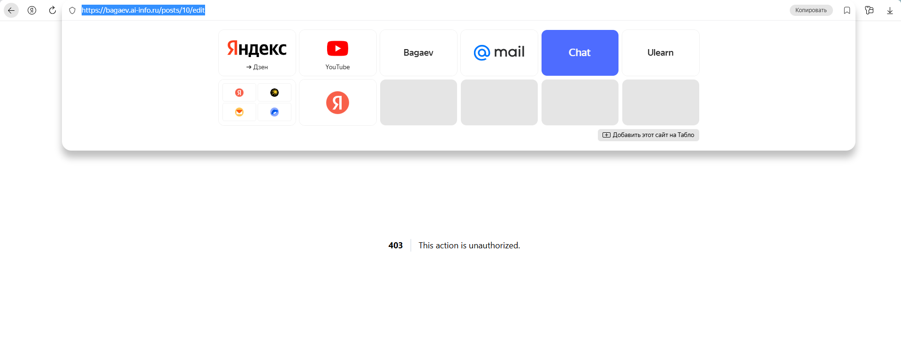

**Защитный вопрос:** *Сравните Policy с ручной авторизацией в Lab10–11.*  
В Policy логика вынесена и в одном месте, а раньше сами ручками через if-ы прописывали проверки, да везде повторяли, если надо - сейчас короче и удобнее

### 15. Удаление поста
`destroy` с Policy, после удаления редирект на `/posts`.

**Скриншот:**  
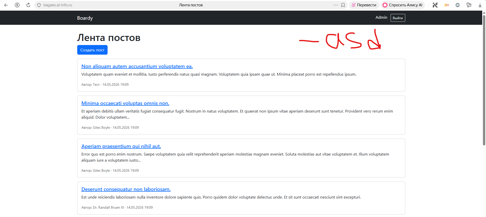

### 16. Комментарий через Blade
`CommentController@store` сохраняет `body`, привязывает к `user_id` (auth) и `post_id`. После сохранения – редирект обратно на страницу поста.

**Скриншот:**  
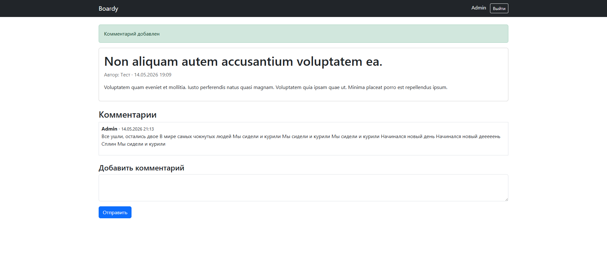

---

## Часть D. Breeze + Socialite

### 17. Установка Breeze
`composer require laravel/breeze --dev`, `php artisan breeze:install blade`, `npm install && npm run build`, миграция.

**Скриншоты:**  
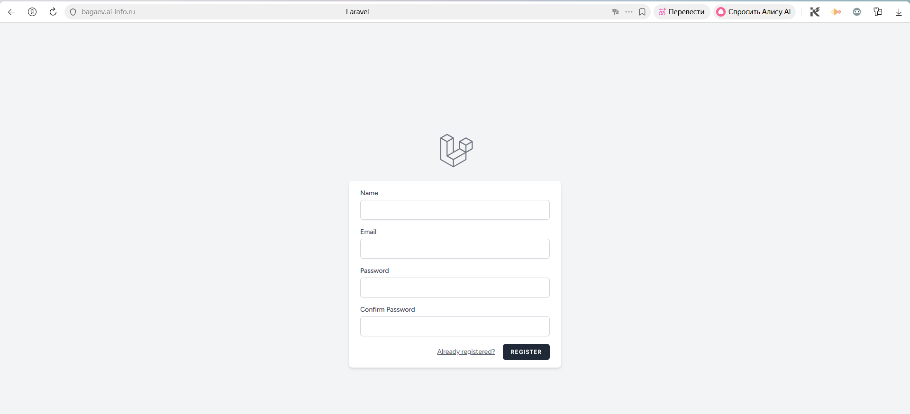  
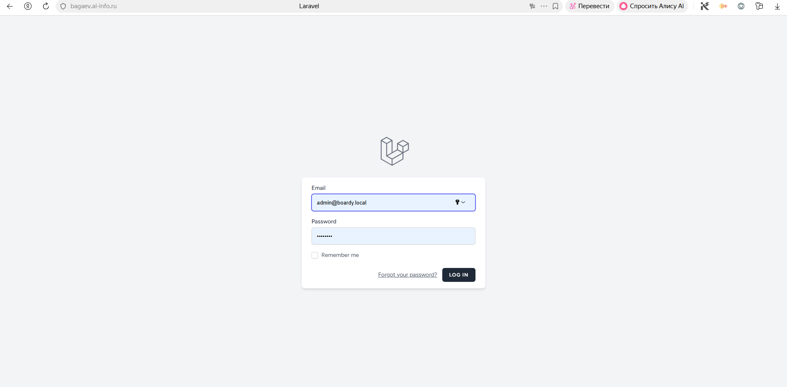

### 18. Регистрация и вход
Пользователь создан через `/register`, после входа имя отображается в navbar.

**Скриншот:**  
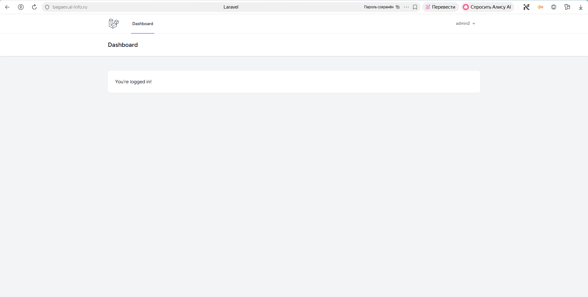

### 19. GitHub OAuth-приложение
Создано приложение, callback: `https://фамилия.ai-info.ru/auth/github/callback`.

**Скриншот:**  
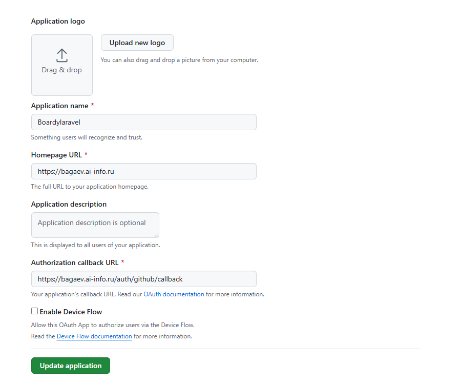

### 20. Socialite
Установлен `laravel/socialite`, добавлена миграция `github_id`, настройки `config/services.php`, `.env` (GITHUB_CLIENT_ID, GITHUB_CLIENT_SECRET, GITHUB_REDIRECT). Создан `GitHubController`, маршруты `auth/github/redirect` и `auth/github/callback`. Кнопка «Войти через GitHub» добавлена в форму `/login`.

**Скриншот:**  
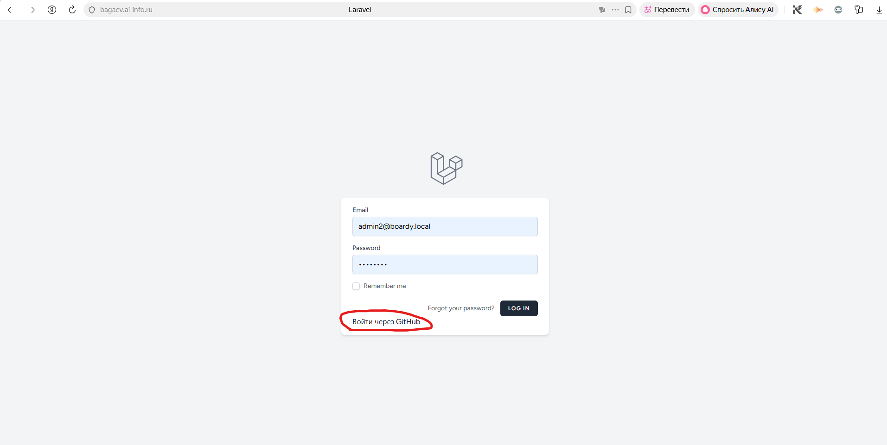

### 21. Полный OAuth flow
Нажатие на кнопку → редирект на GitHub → авторизация → callback → поиск/создание пользователя по `github_id` → вход.

**Скриншоты:**  
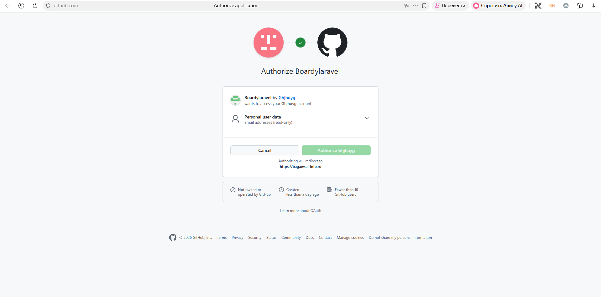  
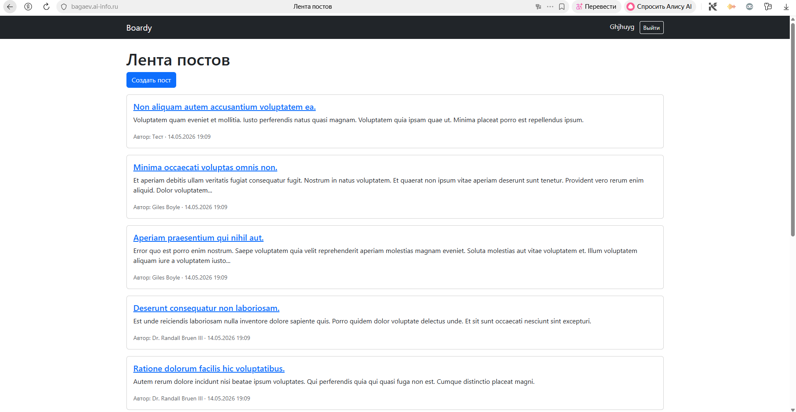  
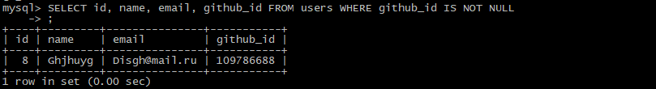

**Защитный вопрос:** *Сравните количество строк кода ручного OAuth (Lab11) и Socialite.*
Строк кода меньше в десятки раз - пропала чихарда с токенами при передаче на стронний сервис, генерацией сессий, поиском\созданием пользователей (понимаю, не пропала, а скрылась за пакетами ларавеля, но мы её уже не прописываем, не видим, не трогаем, лишь используем)

---

## Часть E. Архитектурные вопросы

### 22. Что осталось от прошлых практик
У вас на VPS лежат /var/www/boardy-legacy/ (старый PHP) и БД boardy. Зачем мы их не удалили? Что произойдёт, если попробовать открыть https://фамилия.ai-info.ru/login.php (старый PHP-логин)?

Они не мешают работе Laravel (разные корни, разные БД), при откате к можно быстро переключить document_root, если попробовать открыть https://фамилия.ai-info.ru/login.php (старый PHP-логин) - этот файл просто не найдётся

### 23. FastAPI и React
FastAPI продолжает работать на api.фамилия.ai-info.ru, а React-файлы лежат в Lab9–11. Но в Laravel-проекте мы их не используем. Почему сейчас не используем — что мешает интегрировать? Где они нам пригодятся в Lab13?

Мешает файт того, что FastApi и Laravel не общаются и FastApi не умеет проверять пользователей Laravel. Пригодится при внедрении redis и когда будем ставить passport
### 24. Реалтайм
Сейчас комментарии появляются только после F5. Какое архитектурное решение нам нужно, чтобы один пользователь видел новый комментарий другого без перезагрузки? Какие два сервера-кандидата для этого решения и почему именно они?

- **Laravel Reverb** (WebSocket-сервер) – нативный для Laravel, прост в настройке, хорошо работает с Redis.
- **Node.js + Socket.io** – более гибкий, но требует отдельного сервера.

Reverb оставляет всё в экосистеме PHP/Laravel, Node.js даёт больше контроля и производительности для высоких нагрузок.