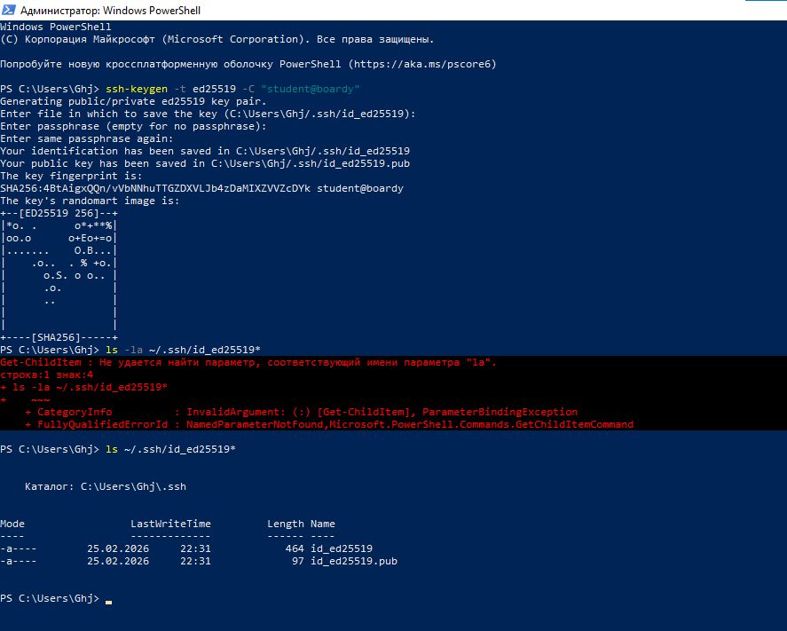
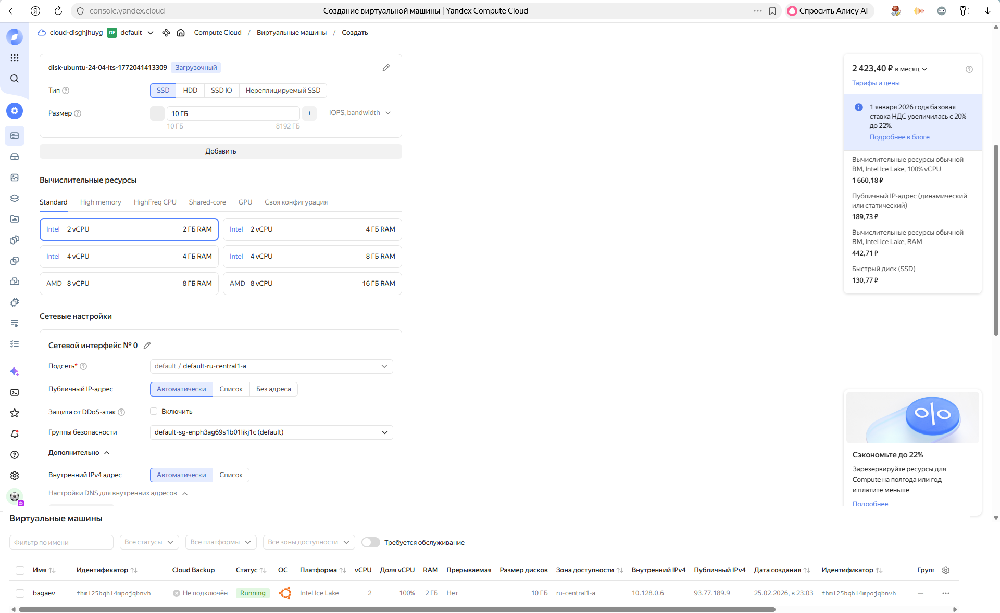
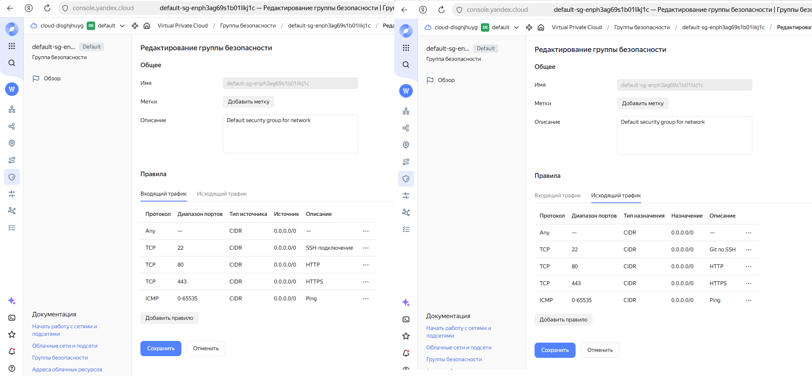
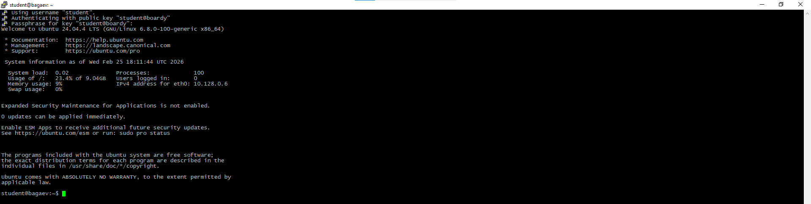
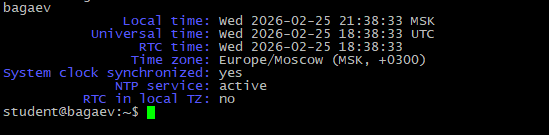
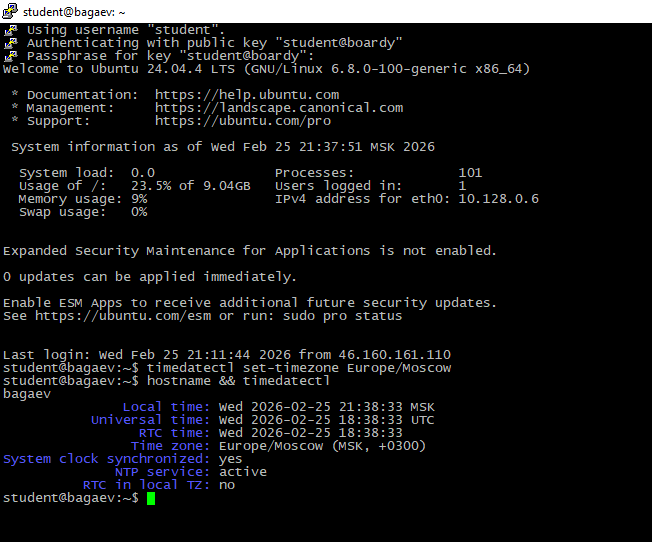
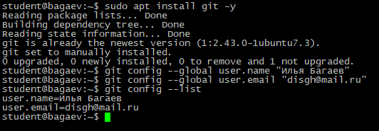
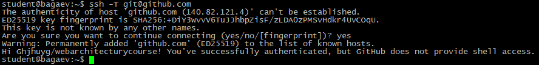
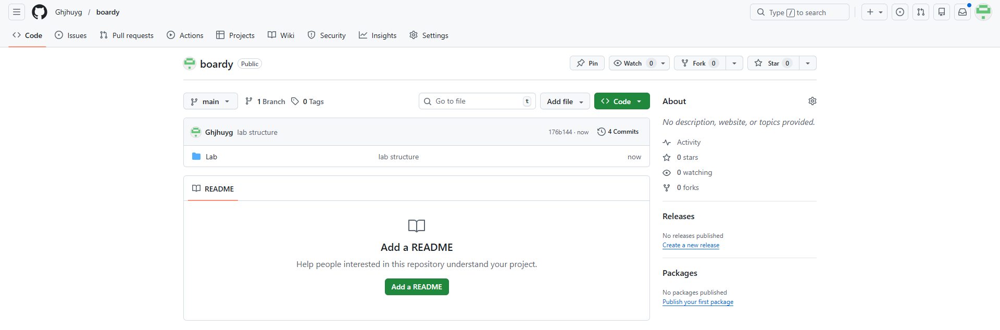
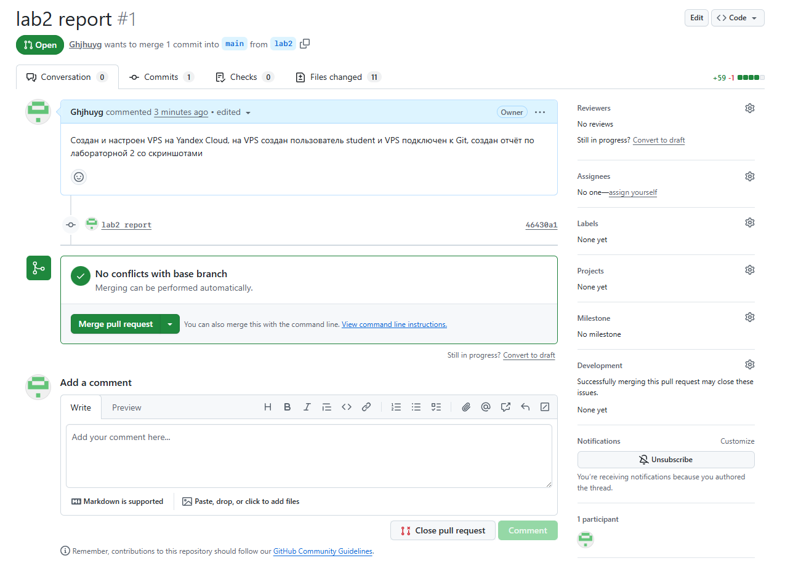

Задание 1. SSH-ключ
Сгенерируйте SSH-ключ и покажите результат:

Скриншоты:

---
Задание 2. VPS и файрвол
Создайте VPS в VK Cloud (Ubuntu 22.04, SSH-ключ). Настройте файрвол: TCP 22, 80, 443 + ICMP в обоих направлениях.

Я пользовался Yandex Cloud, на скришотах 2 и 3 представленны соответсвующие аналоги панелей VK Cloud vps и firewall на Yandex Cloud. (На втором скриншоте не видно ip, он становится виден только при запуске ВМ)

Скриншоты:

---
Задание 3. Подключение через PuTTY
Подключитесь к VPS через PuTTY с SSH-ключом (.ppk).

Скриншоты:

---
Задание 4. Настройка сервера
Изменили временную зону и имя хоста

Скриншоты:

---
Задание 5. Пользователь student
Создайте пользователя student, скопируйте SSH-ключ, переподключитесь

Скриншоты:

---
Задание 6. Git и SSH-ключ → GitHub
Установите Git, настройте имя/email. Добавьте SSH-ключ VPS в GitHub. Проверьте:

Скриншоты:

---
Задание 7. Репозиторий и структура
Клонируйте (или создайте) репозиторий boardy. Создайте структуру Lab/Lab1/, Lab/Lab2/.

Скриншоты:

---
Задание 8. Ветка и Pull Request
Создайте ветку lab2, добавьте отчёт и скриншоты, отправьте ветку на GitHub, создайте Pull Request:

Скриншоты:

