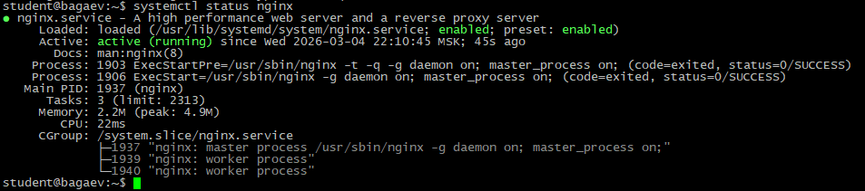
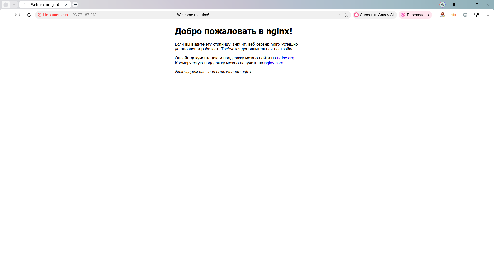
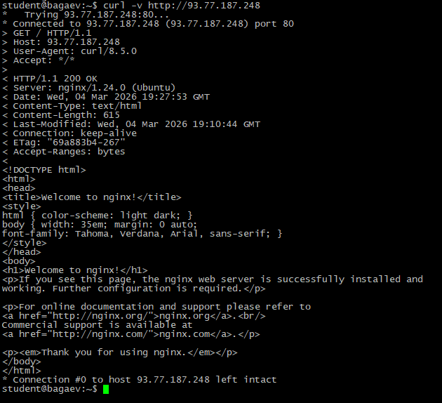
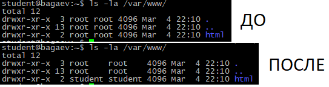
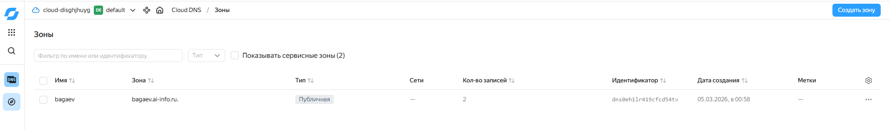
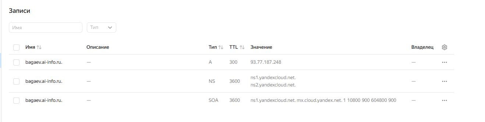
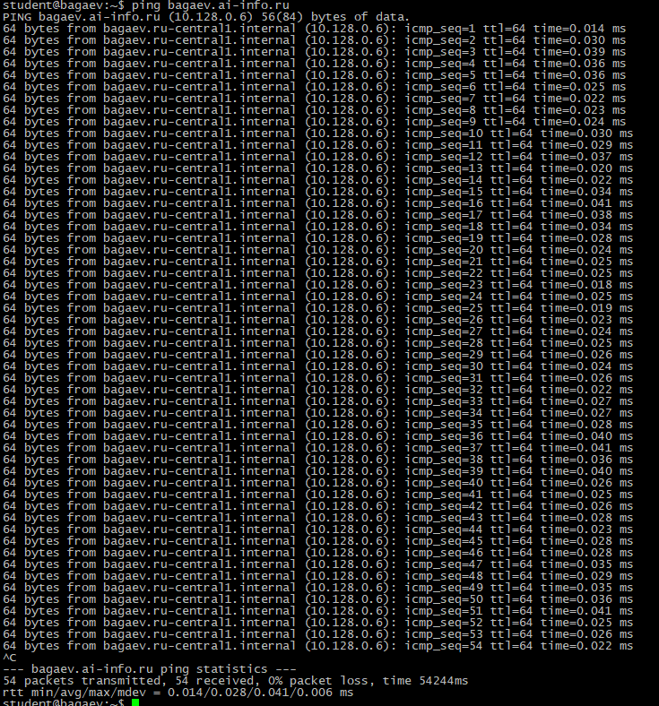
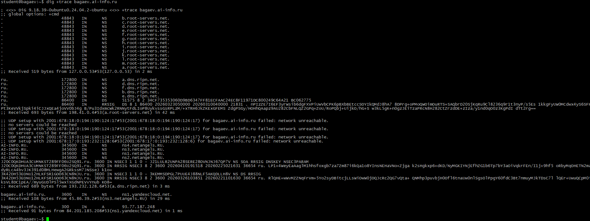
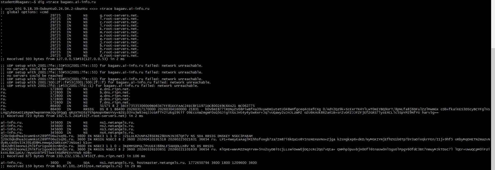
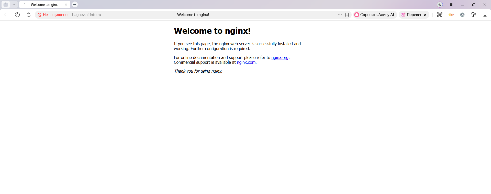

Задание 1. Установка Nginx
Установите Nginx. Убедитесь, что он работает

Скриншоты:

---
Задание 2. Страница по IP
Откройте IP вашего VPS в браузере. Должна быть дефолтная страница Nginx.

Скриншоты:

---
Задание 3. curl
Проверьте сайт через curl

Вывод:
> GET / HTTP/1.1 - Строка запроса
< HTTP/1.1 200 OK - Код ответа
< Content-Type: text/html - Тип контента

Скриншоты:

---
Задание 4. Директория и права
Найдите файл, который Nginx отдаёт. Смените владельца на student

Скриншоты:

---
Задание 5. Конфигурация Nginx
Посмотрите дефолтный конфиг.

listen 80 default_server;
listen [::]:80 default_server;
Указывает какой порт прослушивает сервер

root /var/www/html;
Путь к корневой папке сайта с html-документами

index index.html index.htm index.nginx-debian.html;
Названия файлов, которые Nginx будет искать при обращении к директории

server_name _;
Доменное имя сервера (_ - любое)
---
Задание 6. DNS-зона
Создайте DNS-зону в VK Cloud: bagaev.ai-info.ru.

Скриншоты:

---
Задание 7. A-запись
Создайте A-запись: фамилия.ai-info.ru → IP вашего VPS. TTL = 300

Скриншоты:

---
Задание 8. ping
Скриншоты:

---
Задание 9. dig
;; QUESTION SECTION:
;bagaev.ai-info.ru.        IN    A

;; ANSWER SECTION:
bagaev.ai-info.ru.    60    IN    A    10.128.0.6

;; SERVER: 127.0.0.53#53(127.0.0.53) (UDP)
Скриншоты:

---
Задание 10. dig +trace

;; global options: +cmd
.                       48843   IN      NS      b.root-servers.net.
.                       48843   IN      NS      c.root-servers.net.
.                       48843   IN      NS      d.root-servers.net.
.                       48843   IN      NS      e.root-servers.net.
.                       48843   IN      NS      f.root-servers.net.
.                       48843   IN      NS      g.root-servers.net.
.                       48843   IN      NS      h.root-servers.net.
.                       48843   IN      NS      i.root-servers.net.
.                       48843   IN      NS      j.root-servers.net.
.                       48843   IN      NS      k.root-servers.net.
.                       48843   IN      NS      l.root-servers.net.
.                       48843   IN      NS      m.root-servers.net.
.                       48843   IN      NS      a.root-servers.net.
;; Received 519 bytes from 127.0.0.53#53(127.0.0.53) in 2 ms

ru.                     172800  IN      NS      a.dns.ripn.net.
ru.                     172800  IN      NS      d.dns.ripn.net.
ru.                     172800  IN      NS      f.dns.ripn.net.
ru.                     172800  IN      NS      b.dns.ripn.net.
ru.                     172800  IN      NS      e.dns.ripn.net.
ru.                     86400   IN      DS      51575 8 2 34CF735353060D9BD6347FF81ECFAAC24EC8F11971DC800249C64A21 BC062775
ru.                     86400   IN      RRSIG   DS 8 1 86400 20260323050000 20260310040000 21831 . nPIzZE7I6EF3yrWsib6dgFXVPiUwVbCPK6pBXbBEtccSOYIkQMdJ8hA7 8DPrg+oPMoQWOimOuRTS+SAQbrD20SjKqRu9Cl8236q9r1t3nyP/s5Es 1kkgFyUW0MCdwx4yS6SFHP9lPt3KeVVkjSpki4iCJJxQEa4joVV0bJ4g B/Pu3IdxmcWk2RNNytFdLIoP8UykvssGsRPLzM/+xTRH6JkZKExGFEMS ZdgPSGy/HOHhQAapz9AU282CbFNLQZ2GPq+ZoU/RoPQbj+UijkO/hG+S w3kL5gK+n0gzJEiTzaPRcN8H282CtZrzdDE+zIza/y1nd0qO0z3KgPdI dTt2rg==
;; Received 693 bytes from 198.41.0.4#53(a.root-servers.net) in 42 ms

;; UDP setup with 2001:678:18:0:194:190:124:17#53(2001:678:18:0:194:190:124:17) for bagaev.ai-info.ru failed: network unreachable.
;; no servers could be reached
;; UDP setup with 2001:678:18:0:194:190:124:17#53(2001:678:18:0:194:190:124:17) for bagaev.ai-info.ru failed: network unreachable.
;; no servers could be reached
;; UDP setup with 2001:678:18:0:194:190:124:17#53(2001:678:18:0:194:190:124:17) for bagaev.ai-info.ru failed: network unreachable.
;; UDP setup with 2001:678:17:0:193:232:128:6#53(2001:678:17:0:193:232:128:6) for bagaev.ai-info.ru failed: network unreachable.
AI-INFO.RU.             345600  IN      NS      ns4.netangels.RU.
AI-INFO.RU.             345600  IN      NS      ns3.netangels.RU.
AI-INFO.RU.             345600  IN      NS      ns1.netangels.RU.
AI-INFO.RU.             345600  IN      NS      ns2.netangels.RU.
J20C0QKDHUA3CUMNKST289FF06U2SQ91.ru. 3600 IN NSEC3 1 1 0 - J21LULR2UNPA28SERE28OVNJNJ67QP7V NS SOA RRSIG DNSKEY NSEC3PARAM
J20C0QKDHUA3CUMNKST289FF06U2SQ91.ru. 3600 IN RRSIG NSEC3 8 2 3600 20260410191518 20260225021631 36654 ru. LP1+4WeyEaAaglM1hhsfoxgb7za7Zm87i6kQa1o8YInsNEHaVNo+Zjga k2sHgkxp6+dKD/NyMGKIYNjEfhZG1b6Tp7bY3aOiVqkrFEn/I1j+9hf5 oRbyMqOHETN2mazvNdyRLcA4bv3JK391d08MLHewgA2GRkssM7JNSseJ k1o=
3K42DH53EONU12HLKFSR1GOO63CN8NJU.ru. 3600 IN NSEC3 1 1 0 - 3KEMMSDPGL7PUUE4J88NLF5AKQDLLH8V NS DS RRSIG
3K42DH53EONU12HLKFSR1GOO63CN8NJU.ru. 3600 IN RRSIG NSEC3 8 2 3600 20260326103851 20260221101630 36654 ru. RlQHE+wWvMZZNqFrVm+5Yo2syDBitcjLLsWiOwW0jOQJcRc2QG7vQta+ QNMhp3puvbjH0Ofl6tnaUw0nlSgsOlPpgY60fdC3Bt7nmuyMJkTDsC7l lQEr+UwuQCpM0iFziksVL8DC1pEA//myuGUDlPSl5wxiXGdNPEVvYnub KO8=
;; Received 689 bytes from 193.232.128.6#53(a.dns.ripn.net) in 3 ms

bagaev.ai-info.ru.      3600    IN      NS      ns1.yandexcloud.net.
;; Received 108 bytes from 45.86.39.2#53(ns3.netangels.RU) in 29 ms

bagaev.ai-info.ru.      300     IN      A       93.77.187.248
;; Received 91 bytes from 84.201.185.208#53(ns1.yandexcloud.net) in 1 ms

Скриншоты:

Задание 11. Сайт по домену
Откройте домен в браузере. Должна быть та же дефолтная страница Nginx

Скриншоты:

