Задание 1. Директория проекта
Создайте директорию /var/www/boardy и передайте права пользователю student

Скриншоты:

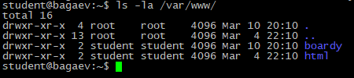
---
Задание 2. Конфиг виртуального хоста
Создайте конфиг /etc/nginx/sites-available/boardy для вашего домена. Конфиг должен содержать: server_name, root, index, отдельные access_log и error_log, кастомную error_page 404.
Активируйте конфиг (симлинка в sites-enabled), отключите default

server_name - имя сервера\домен сайта, по которому можно к нему обратиться
root - корневая папка сервера со всеми его файлами
access_log - папка с логами запросов к серверу
error_log - папка с логами ошибок сервера
try_files - попробовать найти файл по url запросу, если его нет - выдать ошибку 404
error_page - html файл, который будет выдан при ошибке 404

Скриншоты:

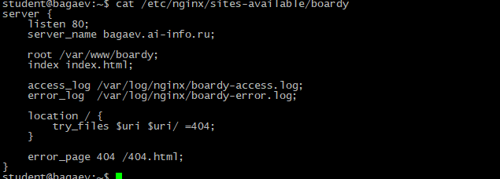
---
Задание 3. Лендинг
Создайте /var/www/boardy/index.html — главную страницу Boardy с названием проекта, описанием и ссылкой на форму обратной связи.

Скриншоты:

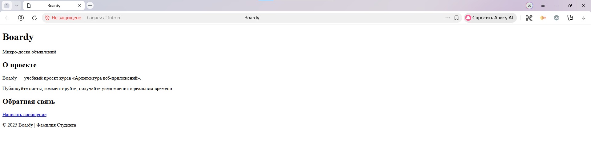
---
Задание 4. Форма обратной связи
Создайте /var/www/boardy/feedback.html с формой: поля «Имя» и «Сообщение», кнопка «Отправить». Атрибуты формы: method="POST" action="/submit".

Скриншоты:

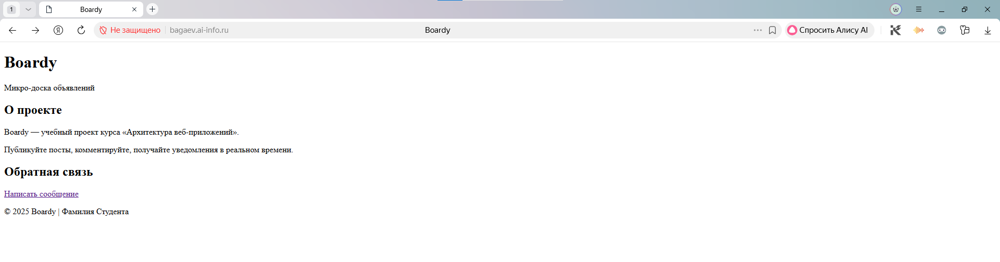
---
Задание 5. Стили и 404
Создайте css/style.css и кастомную 404.html. Все страницы должны подключать CSS.

Создал свой стиль, наполнение html то же что и в практике к лабе, надеюсь это не послужит поводом к снижению оценки.

Скриншоты:

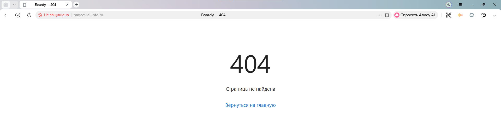
---
Задание 6. DNS-запись для поддомена
Создайте A-запись в VK Cloud: api.фамилия.ai-info.ru → IP вашего VPS.

Создал в Yandex Cloud

Скриншоты:

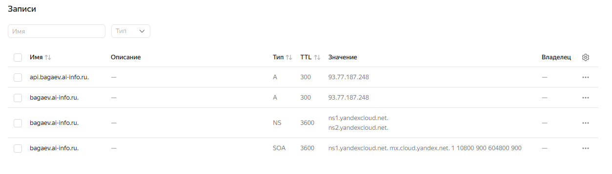
---
Задание 7. Проверка DNS
Убедитесь, что поддомен резолвится.

Скриншоты:

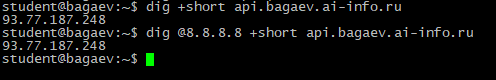
---
Задание 8. Конфиг и заглушка API
Создайте директорию /var/www/boardy-api, заглушку index.html (текст: «Boardy API — Service: OK»), конфиг /etc/nginx/sites-available/boardy-api с server_name api.фамилия.ai-info.ru и отдельными логами. Активируйте.

Скриншоты:

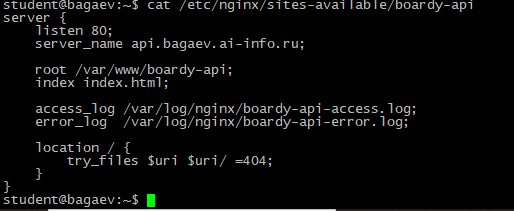
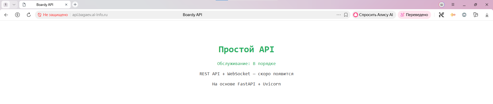
---
Задание 9. GET-запрос через curl -v

* Host bagaev.ai-info.ru:80 was resolved.
* IPv6: (none)
* IPv4: 10.128.0.6
*   Trying 10.128.0.6:80...
* Connected to bagaev.ai-info.ru (10.128.0.6) port 80
> GET / HTTP/1.1 - стартовая строка запроса (метод, путь, версия)
> Host: bagaev.ai-info.ru - заголовок Host
> User-Agent: curl/8.5.0
> Accept: */*
>
< HTTP/1.1 200 OK - стартовая строка ответа (код, пояснение)
< Server: nginx/1.24.0 (Ubuntu)
< Date: Wed, 11 Mar 2026 19:35:45 GMT
< Content-Type: text/html - Content-Type
< Content-Length: 1008 - Content-Length
< Last-Modified: Wed, 11 Mar 2026 18:10:25 GMT
< Connection: keep-alive
< ETag: "69b1b011-3f0"
< Accept-Ranges: bytes
<
<!DOCTYPE html>
<html lang="ru">
<head>
    <meta charset="utf-8">
    <meta name="viewport" content="width=device-width, initial-scale=1">
    <title>Boardy</title>
    <link rel="stylesheet" href="/css/style.css">
</head>
<body>
    <header>
        <h1>Boardy</h1>
        
Микро-доска объявлений

    </header>
    <main>
        <section>
            <h2>О проекте</h2>
            
Boardy — учебный проект курса
               «Архитектура веб-приложений».

            
Публикуйте посты, комментируйте,
               получайте уведомления в реальном времени.

        </section>
        <section>
            <h2>Обратная связь</h2>
            
<a href="/feedback.html">Написать сообщение</a>

        </section>
    </main>
    <footer>
        
&copy; 2025 Boardy | Bagaev

    </footer>
</body>
</html>
* Connection #0 to host bagaev.ai-info.ru left intact

Скриншоты:

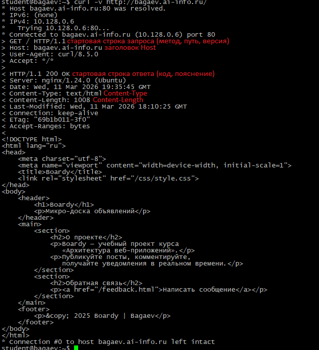
---
Задание 10. Виртуальные хосты в действии
Отправьте запросы по IP с разными заголовками Host

student@bagaev:~$  curl -H "Host: bagaev.ai-info.ru" http://93.77.187.248/
<!DOCTYPE html>
<html lang="ru">
<head>
    <meta charset="utf-8">
    <meta name="viewport" content="width=device-width, initial-scale=1">
    <title>Boardy</title>
    <link rel="stylesheet" href="/css/style.css">
</head>
<body>
    <header>
        <h1>Boardy</h1>
        
Микро-доска объявлений

    </header>
    <main>
        <section>
            <h2>О проекте</h2>
            
Boardy — учебный проект курса
               «Архитектура веб-приложений».

            
Публикуйте посты, комментируйте,
               получайте уведомления в реальном времени.

        </section>
        <section>
            <h2>Обратная связь</h2>
            
<a href="/feedback.html">Написать сообщение</a>

        </section>
    </main>
    <footer>
        
&copy; 2025 Boardy | Bagaev

    </footer>
</body>
</html>

Обратились к айпи VMS по адресу главной страницы и получили то, что сервер возвращает всем по этому адресу, ожидаемо и очевидно.

student@bagaev:~$ curl -H "Host: api.bagaev.ai-info.ru" http://93.77.187.248/
<!DOCTYPE html>
<html lang="en">
<head>
    <meta charset="utf-8">
    <title>Boardy API</title>
    
</head>
<body>
    <h1>Boardy API</h1>
    
Service: OK

    
REST API + WebSocket — coming soon

    
Powered by FastAPI + Uvicorn

</body>
</html>

Обратились к айпи VMS по адресу апи и получили то, что сервер возвращает всем по этому адресу, ожидаемо и очевидно.

student@bagaev:~$ curl -H "Host: unknown.ru" http://93.77.187.248/
<!DOCTYPE html>
<html lang="ru">
<head>
    <meta charset="utf-8">
    <meta name="viewport" content="width=device-width, initial-scale=1">
    <title>Boardy</title>
    <link rel="stylesheet" href="/css/style.css">
</head>
<body>
    <header>
        <h1>Boardy</h1>
        
Микро-доска объявлений

    </header>
    <main>
        <section>
            <h2>О проекте</h2>
            
Boardy — учебный проект курса
               «Архитектура веб-приложений».

            
Публикуйте посты, комментируйте,
               получайте уведомления в реальном времени.

        </section>
        <section>
            <h2>Обратная связь</h2>
            
<a href="/feedback.html">Написать сообщение</a>

        </section>
    </main>
    <footer>
        
&copy; 2025 Boardy | Bagaev

    </footer>
</body>
</html>

Обратились к айпи VMS по адресу, который не определён на сервере, но так как мы обратились на айпи VMS он обработал запрос и вернул то, что мы указали по умолчанию, а это как раз главная страница.

Скриншоты:

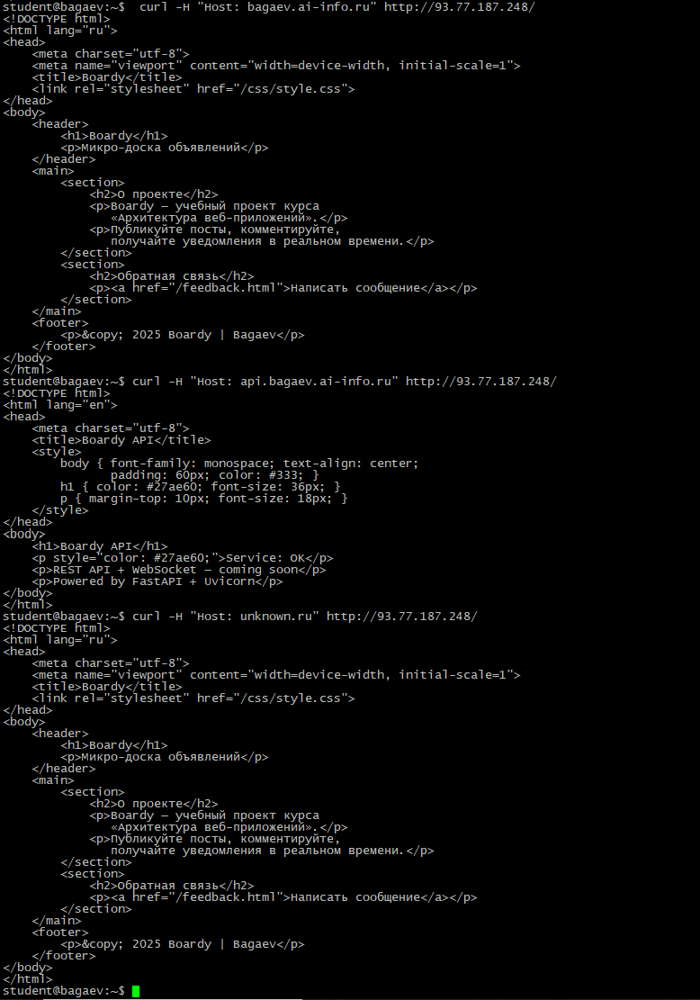
---
Задание 11. POST-запрос
Отправьте форму через curl.

student@bagaev:~$ curl -v -X POST -d "name=Ivanov&message=Hello" http://bagaev.ai-info.ru/submit
Note: Unnecessary use of -X or --request, POST is already inferred.
* Host bagaev.ai-info.ru:80 was resolved.
* IPv6: (none)
* IPv4: 10.128.0.6
*   Trying 10.128.0.6:80...
* Connected to bagaev.ai-info.ru (10.128.0.6) port 80
> POST /submit HTTP/1.1 - метод (POST)
> Host: bagaev.ai-info.ru
> User-Agent: curl/8.5.0
> Accept: */*
> Content-Length: 25
> Content-Type: application/x-www-form-urlencoded - Content-Type запроса
>
< HTTP/1.1 404 Not Found - код ответа
< Server: nginx/1.24.0 (Ubuntu)
< Date: Wed, 11 Mar 2026 20:00:57 GMT
< Content-Type: text/html
< Content-Length: 365
< Connection: keep-alive
< ETag: "69b1b0dd-16d"
<
<!DOCTYPE html> - тело запроса
<html lang="ru">
<head>
    <meta charset="utf-8">
    <title>Boardy — 404</title>
    <link rel="stylesheet" href="/css/style.css">
</head>
<body>
    

        <h1>404</h1>
        
Страница не найдена

        
<a href="/">Вернуться на главную</a>

    

</body>
</html>
* Connection #0 to host bagaev.ai-info.ru left intact

В конфигурации nginx не имеет настроенного пути для /submit - поэтому ошибка 404

Скриншоты:

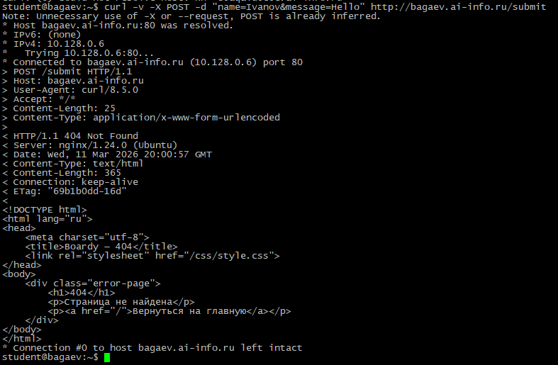
---
Задание 12. HEAD-запрос
Сравните GET и HEAD.

GET запрос получает и "голову" и "тело" (и "хвост") ответа, а HEAD только "голову", в которой только описывается подключение и тело ответа. Цели могут быть разные,
такие как получение данных о теле ответа, проверка доступности запроса и его наличия
---
Задание 13. Раздельные логи
Выполните несколько запросов к обоим сайтам, затем покажите логи.

1 Лог:
46.160.161.110 **(IP)** - - [11/Mar/2026:23:16:43 +0300] "GET **(МЕТОД)** /css/style.css **(ПУТЬ)** HTTP/1.1" 304 **(КОД ОТВЕТА)** 0 "http://bagaev.ai-info.ru/submit" "Mozilla/5.0 (Windows NT 10.0; Win64; x64) AppleWebKit/537.36 (KHTML, like Gecko) Chrome/142.0.0.0 YaBrowser/25.12.0.0 Safari/537.36" **(USER-AGENT)**
87.250.224.237 - - [11/Mar/2026:23:17:13 +0300] "GET /feedback.html HTTP/1.1" 200 515 "-" "Mozilla/5.0 (compatible; YandexBot/3.0; +http://yandex.com/bots)"
1.92.222.246 - - [11/Mar/2026:23:18:01 +0300] "GET /robots.txt HTTP/1.1" 404 292 "http://bagaev.ai-info.ru/robots.txt" "Mozilla/5.0 (Macintosh; Intel Mac OS X 10_15_7) AppleWebKit/537.36 (KHTML, like Gecko) Chrome/123.0.0.0 Safari/537.36"

2 Лог (Всего было 2):
46.160.161.110 - - [11/Mar/2026:22:33:07 +0300] "GET / HTTP/1.1" 200 348 "-" "Mozilla/5.0 (Windows NT 10.0; Win64; x64) AppleWebKit/537.36 (KHTML, like Gecko) Chrome/142.0.0.0 YaBrowser/25.12.0.0 Safari/537.36"
93.77.187.248 - - [11/Mar/2026:22:48:30 +0300] "GET / HTTP/1.1" 200 513 "-" "curl/8.5.0"

Скриншоты:

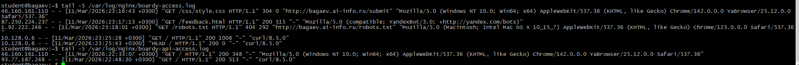
---
Задание 14. Фильтрация логов

Скриншоты:

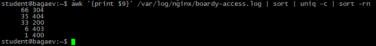
---
Сдача через Pull Request

Скриншоты:

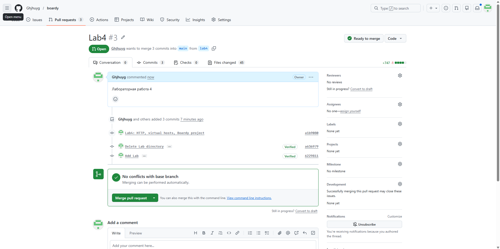