Задание 1. Установка certbot

Скриншоты:

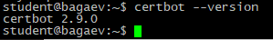
---
Задание 2. Получение сертификата

Скриншоты:

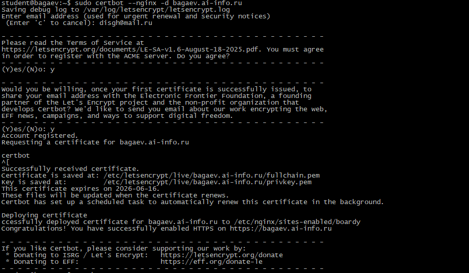
---
Задание 3. Проверка в браузере
Откройте https://bagaev.ai-info.ru/ в браузере. Нажмите на замочек → Сертификат.

Скриншоты:

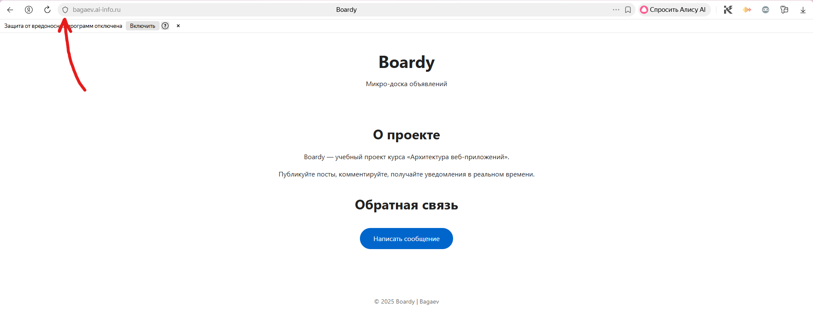
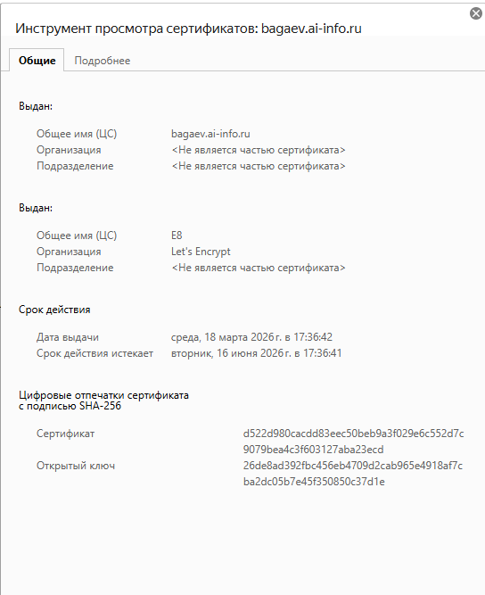
---
Задание 4. Редирект

* Host bagaev.ai-info.ru:80 was resolved.
* IPv6: (none)
* IPv4: 10.128.0.6
*   Trying 10.128.0.6:80...
* Connected to bagaev.ai-info.ru (10.128.0.6) port 80
> GET / HTTP/1.1
> Host: bagaev.ai-info.ru
> User-Agent: curl/8.5.0
> Accept: */*
>
< HTTP/1.1 301 Moved Permanently - *КОД 301*
< Server: nginx/1.24.0 (Ubuntu)
< Date: Wed, 18 Mar 2026 13:40:53 GMT
< Content-Type: text/html
< Content-Length: 178
< Connection: keep-alive
< Location: https://bagaev.ai-info.ru/ - *Заголовок Location*
<
<html>
<head><title>301 Moved Permanently</title></head>
<body>

<h1>301 Moved Permanently</h1>

nginx/1.24.0 (Ubuntu)

</body>
</html>
* Connection #0 to host bagaev.ai-info.ru left intact

Скриншоты:

---
Задание 5. Конфиг после certbot

server {
    server_name bagaev.ai-info.ru;

    root /var/www/boardy;
    index index.html;

    access_log /var/log/nginx/boardy-access.log;
    error_log  /var/log/nginx/boardy-error.log;

    location / {
        try_files $uri $uri/ =404;
    }

    error_page 404 /404.html;

    listen 443 ssl; # managed by Certbot - *listen 443 ssl*
    ssl_certificate /etc/letsencrypt/live/bagaev.ai-info.ru/fullchain.pem; # managed by Certbot - *ssl_certificate*
    ssl_certificate_key /etc/letsencrypt/live/bagaev.ai-info.ru/privkey.pem; # managed by Certbot - *ssl_certificate_key*
    include /etc/letsencrypt/options-ssl-nginx.conf; # managed by Certbot
    ssl_dhparam /etc/letsencrypt/ssl-dhparams.pem; # managed by Certbot

}
server {
    if ($host = bagaev.ai-info.ru) {
        return 301 https://$host$request_uri;
    } # managed by Certbot

    listen 80;
    server_name bagaev.ai-info.ru;
    return 404; # managed by Certbot

}

Скриншоты:

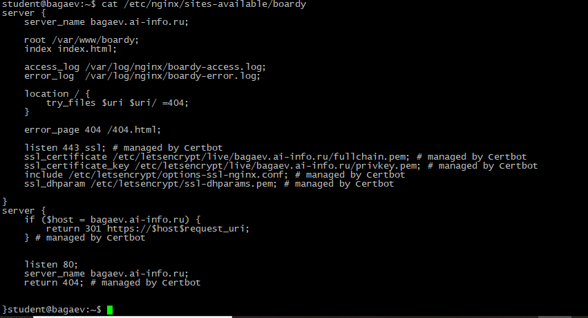
---
Задание 6. Сертификат для api-поддомена
Создайте A-запись в VK Cloud: api.bagaev.ai-info.ru → IP вашего VPS.

Скриншоты:

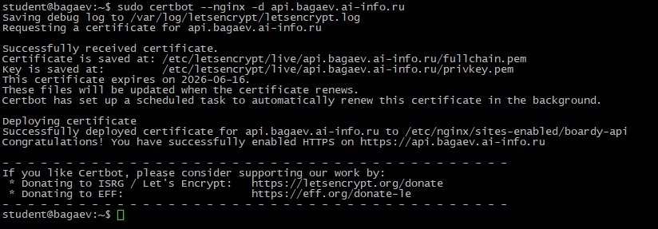
---
Задание 7. Проверка обоих доменов

Скриншоты:

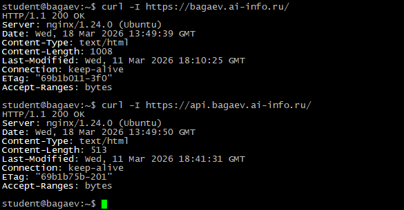
---
Задание 8. TLS handshake

  % Total    % Received % Xferd  Average Speed   Time    Time     Time  Current
                                 Dload  Upload   Total   Spent    Left  Speed
  0     0    0     0    0     0      0      0 --:--:-- --:--:-- --:--:--     0* Host bagaev.ai-info.ru:443 was resolved.
* IPv6: (none)
* IPv4: 10.128.0.6
*   Trying 10.128.0.6:443...
* Connected to bagaev.ai-info.ru (10.128.0.6) port 443
* ALPN: curl offers h2,http/1.1
} [5 bytes data]
* TLSv1.3 (OUT) - , TLS handshake, Client hello (1):
} [512 bytes data]
*  CAfile: /etc/ssl/certs/ca-certificates.crt
*  CApath: /etc/ssl/certs
{ [5 bytes data]
* TLSv1.3 (IN), TLS handshake, Server hello (2):
{ [122 bytes data]
* TLSv1.3 (IN), TLS handshake, Encrypted Extensions (8):
{ [25 bytes data]
* TLSv1.3 (IN), TLS handshake, Certificate (11):
{ [2045 bytes data]
* TLSv1.3 (IN), TLS handshake, CERT verify (15):
{ [79 bytes data]
* TLSv1.3 (IN), TLS handshake, Finished (20):
{ [52 bytes data]
* TLSv1.3 (OUT), TLS change cipher, Change cipher spec (1):

Версия TLS - TLSv1.3, алгоритм шифрования - ecdsa-with-SHA384, Subject - CN = bagaev.ai-info.ru, Issuer - C = US, O = Let's Encrypt, CN = E8, Срок действия - Not Before: Mar 18 12:36:42 2026 GMT Not After : Jun 16 12:36:41 2026 GMT

Скриншоты:

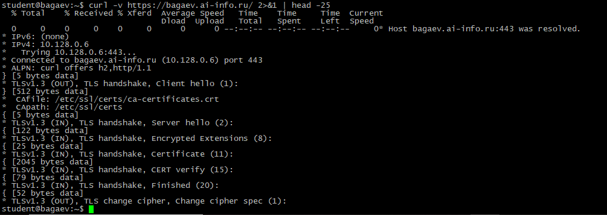
---
Задание 9. Цепочка доверия

ISRG Root X1 - Let's Encrypt E8 - bagaev.ai-info.ru

Браузер из предоставленных сертификатов строит последовательность: сертификат сайта - промежуточный - ищет корневой сертификат в своём хранилище доверенных корневых CA.
Сертификат сайта выдан промежуточным сертификатом, а промежуточный выдан корневым и, если корневой сертификат - это доверенный сертификат браузера, то он доверяет и сертификату сайта.

Скриншоты:

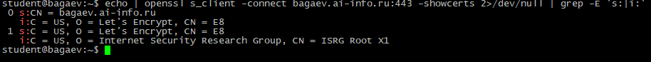
---
Задание 10. Сравнение сертификатов

Разница: Subject
Общее: Срок действия

Скриншоты:

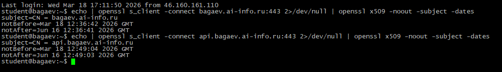
---
Задание 11. HSTS

HSTS - это механизм, который все http ссылки превращает в https, защищает от перехвата\подмены данных мошенниками при первом посещении сайта.

Скриншоты:

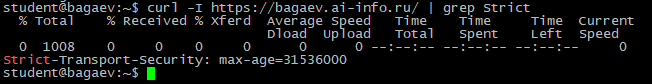
---
Задание 12. Кэширование и gzip
Настройте Cache-Control для статики (css, js, картинки) и gzip. Проверьте.

Скриншоты:

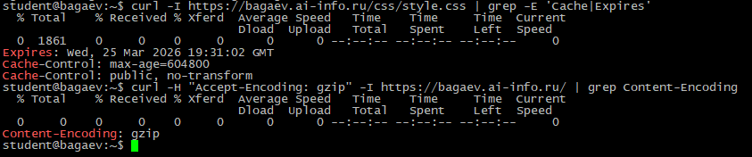
---
Задание 13. Автообновление

Скриншоты:

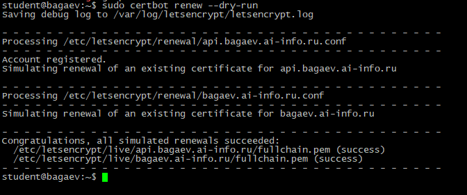
---
Сдача через Pull Request
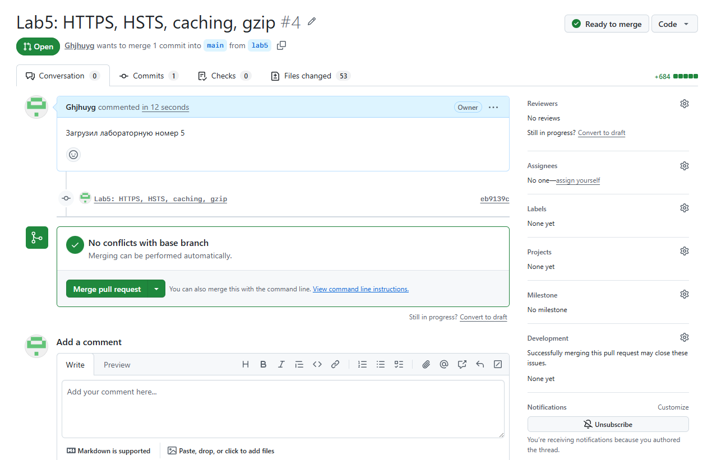