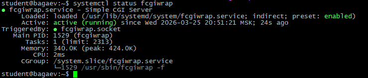
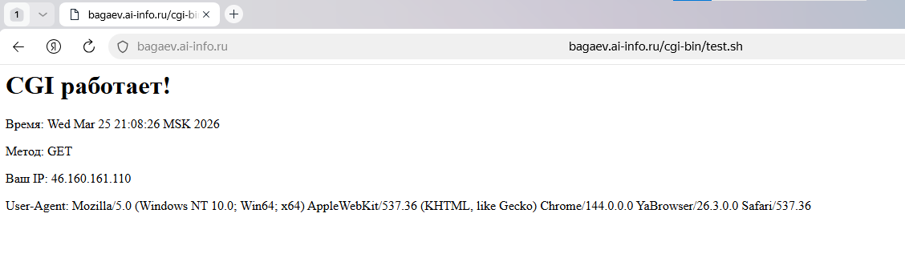
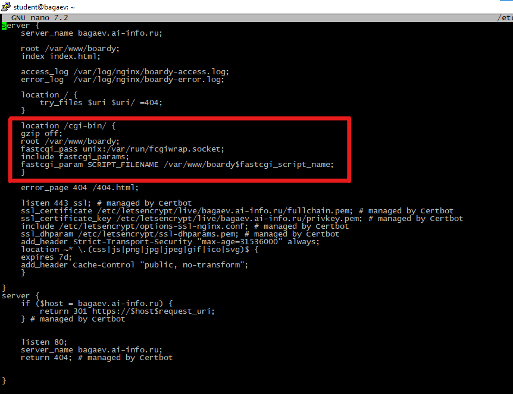
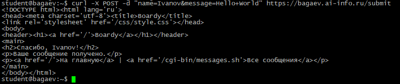
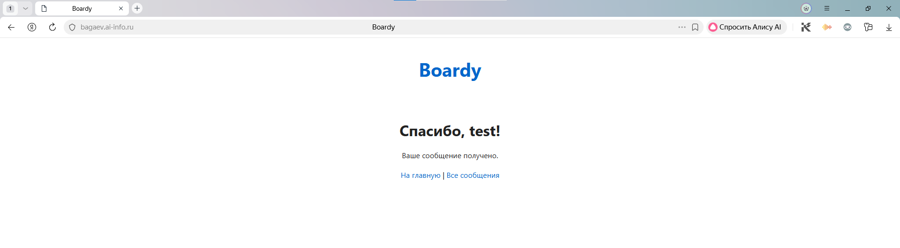
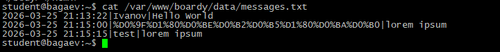
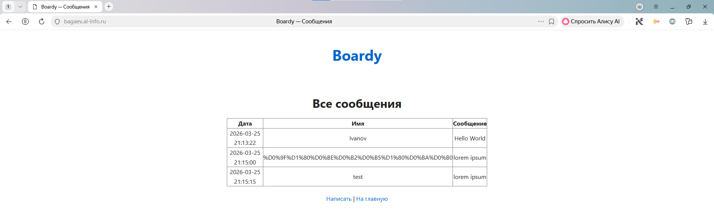
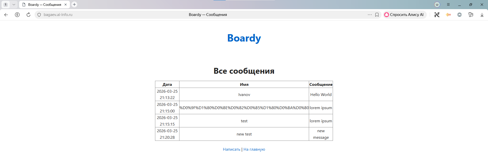
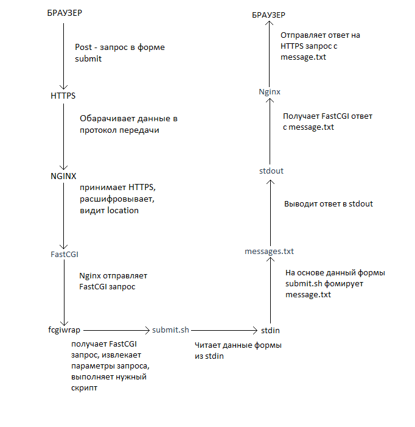
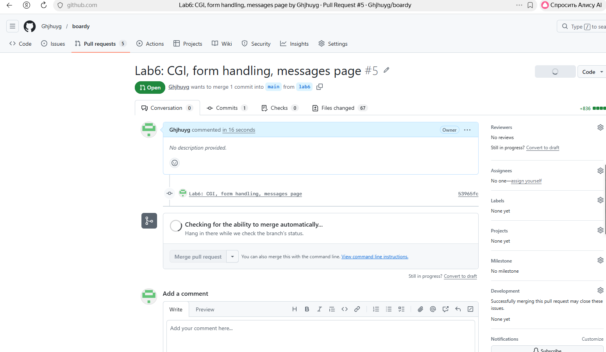

Задание 1. Установка fcgiwrap

Скриншоты:

---
Задание 2. Тестовый скрипт
Создайте /var/www/boardy/cgi-bin/test.sh — выводит время, метод, IP, User-Agent.

Скриншоты:

---
Задание 3. Конфигурация Nginx
Добавьте location /cgi-bin/ в конфиг boardy.

location /cgi-bin/ {
    gzip off;
    root /var/www/boardy;
    fastcgi_pass unix:/var/run/fcgiwrap.socket; - адрес куда отправить запрос (этот адрес как раз прослушивает fcgiwrap)
    include fastcgi_params; - строка, которая добавляет к параметрам запроса набор стандартных fastcgi параметров 
    fastcgi_param SCRIPT_FILENAME /var/www/boardy$fastcgi_script_name; - указывает значение параметра SCRIPT_FILENAME значением /var/www/boardy/cgi-bin/(https://bagaev.ai-info.ru/cgi-bin/**подставляется от сюда**)
}

Скриншоты:

---
Задание 4. Скрипт обработки формы

Создайте submit.sh: читает POST из stdin, извлекает name и message, сохраняет в messages.txt, возвращает «Спасибо, {имя}!».

Скриншоты:

---
Задание 5. Форма в браузере
Откройте feedback.html, заполните, отправьте.

Скриншоты:

---
Задание 6. Данные на диске

Скриншоты:

---
Задание 7. Скрипт вывода сообщений
Создайте messages.sh: читает messages.txt, генерирует HTML-таблицу.

Скриншоты:

---
Задание 8. Полный цикл
Отправьте новое сообщение через форму → откройте страницу сообщений → новое сообщение в списке.

Скриншоты:

---
Задание 9. Путь запроса

Нарисуйте схему пути POST-запроса от формы до записи в файл: браузер → HTTPS → Nginx → FastCGI → fcgiwrap → submit.sh → stdin → messages.txt → stdout → Nginx → браузер.

Скриншоты:

---
Задание 10. Теоретические вопросы

Ответьте (2–3 предложения):
1. Что такое CGI и какую проблему он решил в 1993 году?
Cтандарт, который в 1993 году позволил запускать внешние программы для генерации контента, решая проблему статических HTML страниц.
2. Как CGI-скрипт получает данные POST-запроса?
CGI-скрипт получает данные POST-запроса через stdin, а длина данных передаётся в переменной окружения CONTENT_LENGTH.
3. Почему CGI создаёт проблемы при высокой нагрузке?
CGI создаёт проблемы при высокой нагрузке, потому что каждый запрос требует запуска нового процесса, что приводит к большим накладным расходам на создание/уничтожение процессов и неэффективному использованию ресурсов.
4. Чем отличается fastcgi_pass от proxy_pass?
fastcgi_pass направляет запрос FastCGI-серверу (постоянному процессу), а proxy_pass — HTTP-серверу. FastCGI эффективнее для динамических скриптов, а proxy_pass - других веб-приложений.
5. Зачем нужен fcgiwrap, если Apache запускает CGI напрямую?
fcgiwrap нужен для Nginx, так как Nginx не умеет напрямую запускать CGI-скрипты (в отличие от Apache с mod_cgi), и fcgiwrap выступает адаптером, преобразующим FastCGI-запросы в вызовы CGI-скриптов.

---
Сдача через Pull Request

Скриншоты:

