Задание 1. Установка PHP-FPM

Скриншоты:

---
Задание 2. Форма и сообщения на PHP
Создайте submit.php и messages.php. Обновите action формы.

Скриншоты:

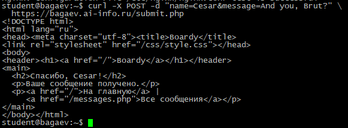
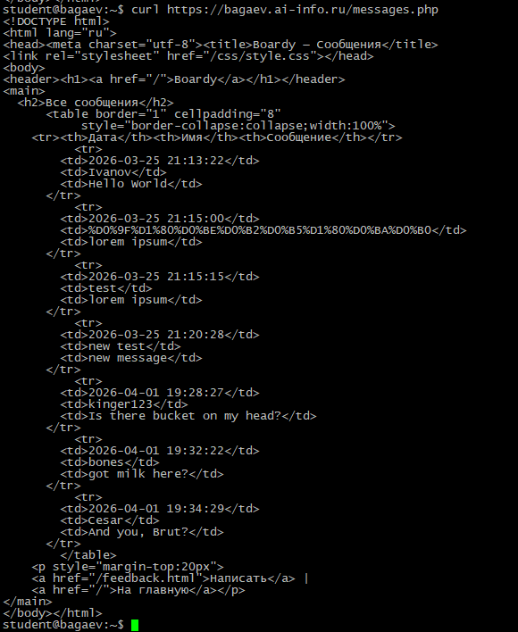
---
Задание 3. Конфиг Nginx для PHP
Добавьте location ~ \.php$ с fastcgi_pass. Закомментируйте CGI.

чем fastcgi_pass отличается от CGI через fcgiwrap? Почему PHP-FPM быстрее?

CGI через fcgiwrap запускает новый процесс скрипта CGI на каждый запрос.
PHP‑FPM быстрее, потому что поддерживает пул заранее запущенных процессов, переиспользует память и кэш, не тратит ресурсы на создание интерпретатора под каждый запрос.

Скриншоты:

---
Задание 4. Shared nothing
Создайте demo-shared-nothing.php (счётчик). Вызовите 3 раза.

почему счётчик не растёт? Что такое shared nothing?

Счётчик не растёт, потому что переменная counter своя для каждого запроса. Shared nothing - как раз и указзывает на то что переменные живут исключительно в запросе.

Скриншоты:

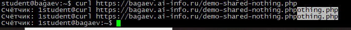
---
Задание 5. Блокировка воркеров
Создайте demo-slow.php (sleep(2)). Запустите 10 параллельных запросов.

сколько заняло? Сколько воркеров у PHP-FPM? Как связаны эти числа?

Заняло: около 4 секунд. Воркеров у PHP-FPM: 5. В запросах мы ждём по 2 секунды, запросов всего 10, первые пять запросов выполняются параллельно за 2 секунды, вторые 5 соответсвенно, таким образом общее время выполненния равно (10/5) * 2 = 4

Скриншоты:

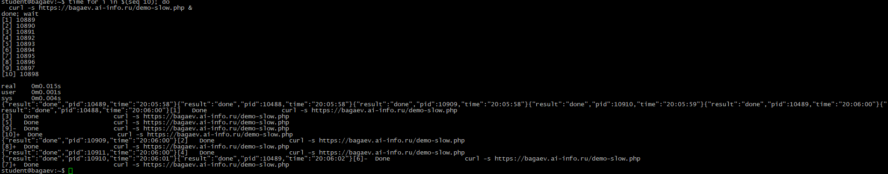
---
Задание 6. Установка и приложение
Установите Python, venv, FastAPI, Uvicorn. Создайте main.py с /api/status, /api/messages, /api/slow, /api/slow-blocking, /api/counter.

Скриншоты:

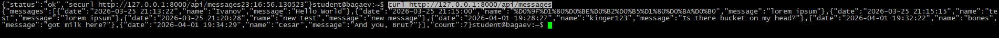
---
Задание 7. Живой процесс (счётчик)

почему здесь счётчик растёт, а в PHP не рос?

Потому что в Fast api не запускает каждый раз новый процесс на каждый запрос, а выполняет всё в одном процессе и, соответсвенно, переменная counter не сбрасывается.

Скриншоты:

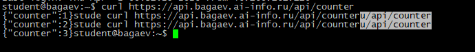
---
Задание 8. Async: 10 запросов за 2 секунды

почему 10 запросов по 2 секунды заняли ~2, а не 20 секунд?

Потому что они выполнялись параллельно, в таком случае время выполнения всех запросов равно максимальному времени выполнения одного запроса, а это как раз 2 секунды

Скриншоты:

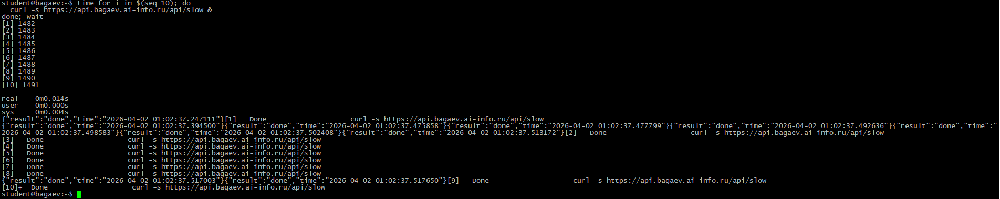
---
Задание 9. Блокирующий код убивает event loop

чем /api/slow отличается от /api/slow-blocking? Почему время разное?

/api/slow отличается от /api/slow-blocking используемым временем для ожидания, в первом случае он ассинхронный, что и позволяет выполнять его паралелльно, а во втором синхронный, именно поэтому время разное

Скриншоты:

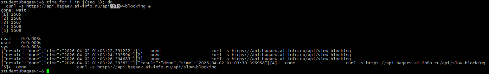

---
Задание 10. Swagger
Откройте https://api.фамилия.ai-info.ru/docs в браузере.

Скриншоты:

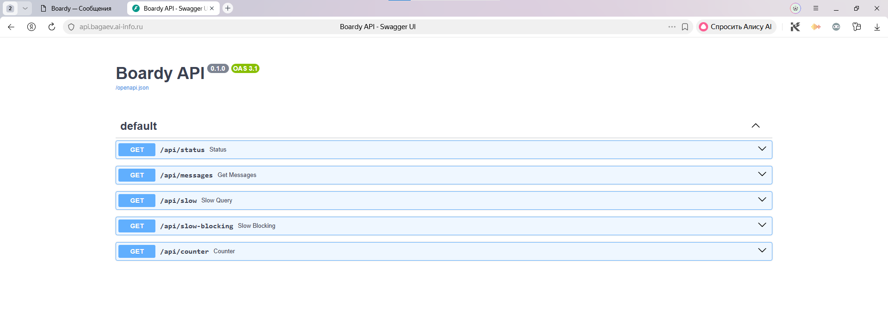

---
Задание 11. systemd-сервис
Создайте /etc/systemd/system/boardy-api.service.

Скриншоты:

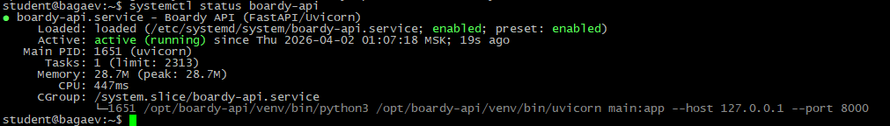

---
Задание 12. Nginx proxy_pass
Замените заглушку на proxy_pass в конфиге boardy-api.

чем proxy_pass отличается от fastcgi_pass? Почему для PHP одно, для Python другое?

Первый используется для передачи по http, а второй для передачи по протоколу fastCGI. PHP работает через PHP-FPM, который ожидает ответа по протоколу fastCGI, а Python (у нас) работает через Uvicorn, который ожидает ответа по протоколу http, а значит и proxy_pass

Скриншоты:

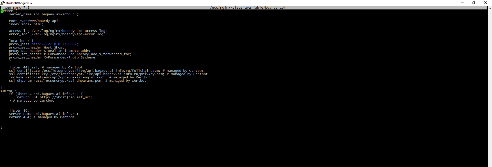

---
Задание 13. Два формата

одни данные, два формата. Чем отличаются? Для кого каждый?
Отличаются форматом, один (html) нужен для того чтобы вывести его пользователю на экране, в виде красивого документа, а второй (json) для различных api, чтобы полученные данные было проще использовать

Скриншоты:

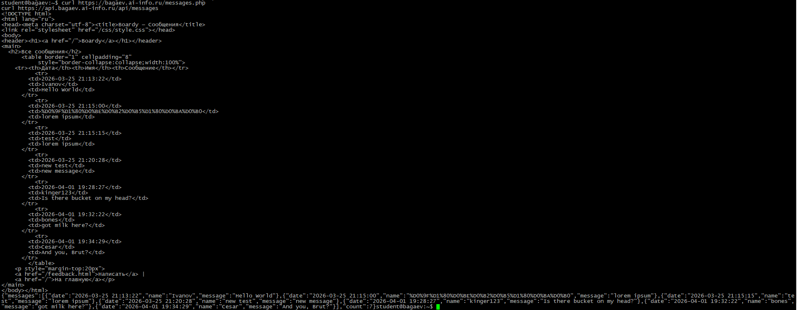

---
Задание 14. Процессы

Скриншоты:

---
Сдача через Pull Request

Скриншоты:

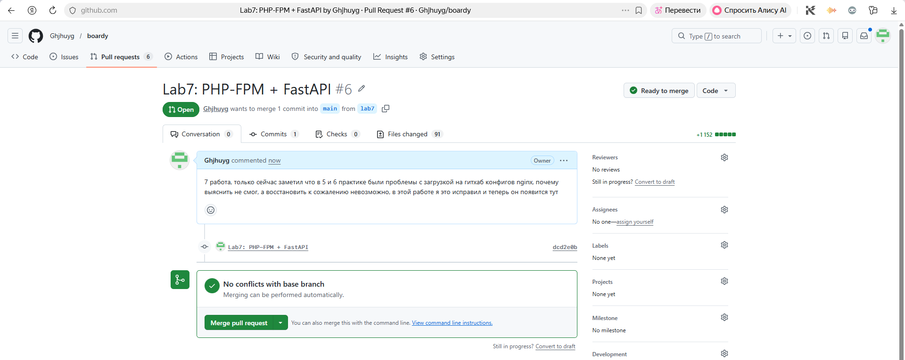