Задание 1. Установка MySQL

Скриншоты:

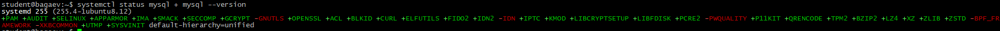
---
Задание 2. База данных и пользователь
Создайте базу boardy (utf8mb4, utf8mb4_unicode_ci), пользователя boardy.

почему utf8mb4, а не utf8? Что такое collation и зачем unicode_ci?
utf8mb4, так как он на самом деле полный utf8 с эмодзи и другими 4х байтовыми символами
collation - правила сортировки
unicode_ci для сортировки русского языка, не чувтсвителен к регистру

Скриншоты:

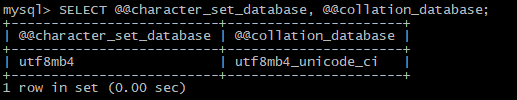
---
Задание 3. phpMyAdmin
Установите phpMyAdmin, подключите к Nginx, войдите под пользователем boardy.

Скриншоты:

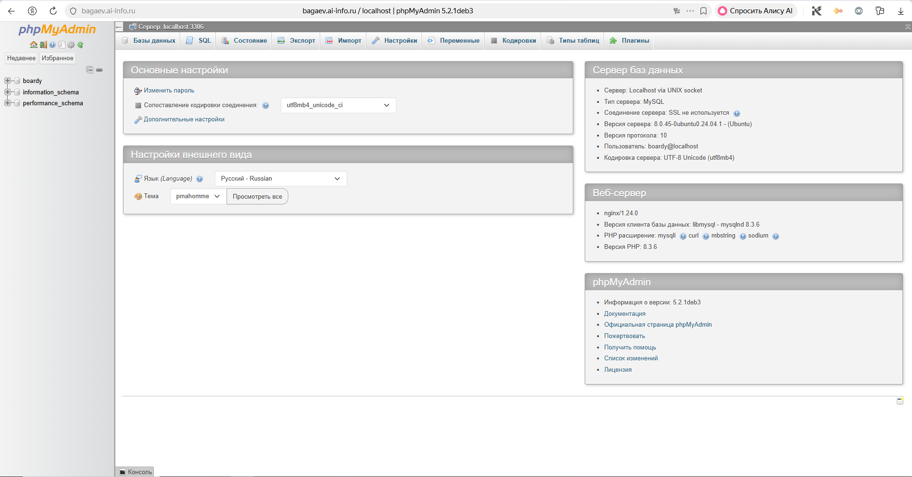
---
Задание 4. Три таблицы
Создайте users, posts, comments с FOREIGN KEY и ON DELETE CASCADE.

что такое FOREIGN KEY и ON DELETE CASCADE? Зачем? Какой движок используется и почему?
FOREIGN KEY - внешний ключ, значение из другой таблицы, используется для связывания двух таблиц
ON DELETE CASCADE - команда, нужна чтобы удалялись все связанные таблицы, при удалении родителей
Движок - InnoDB. Потомучто нужен ACID, нужны Foreign Key, нужны строковые блокировки. 

Скриншоты:

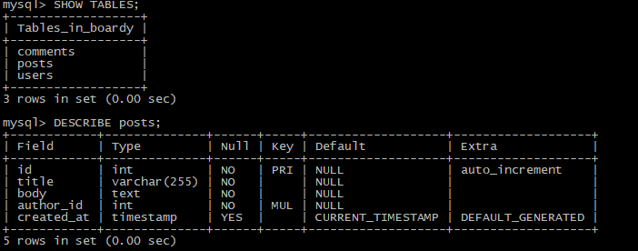
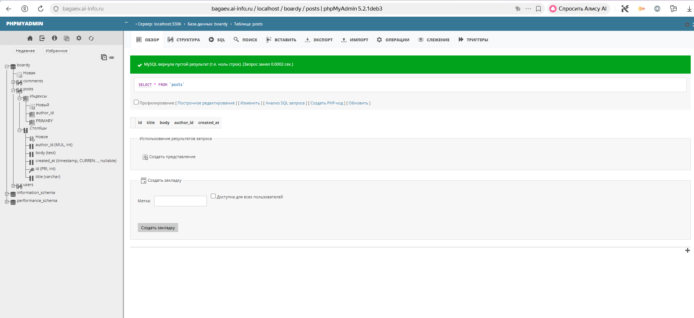
---
Задание 5. SQL-скрипт
Сохраните все CREATE TABLE в файл src/boardy/sql/schema.sql. Добавьте DROP TABLE IF EXISTS в начало (чтобы скрипт работал повторно).

Скриншоты:

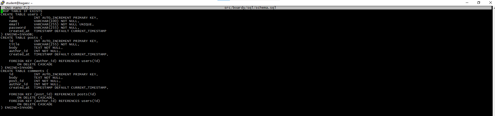
---
Задание 6. INSERT
Добавьте минимум 3 пользователя, 5 постов (от разных авторов), 3 комментария.

Скриншоты:

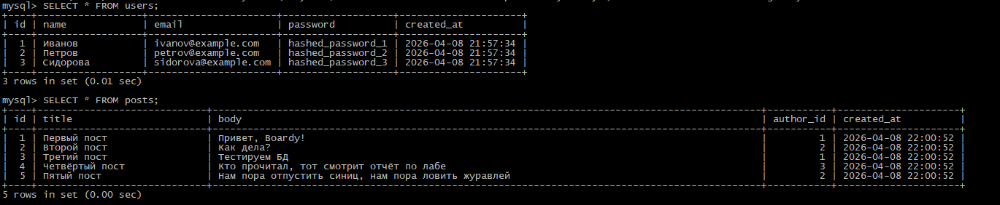
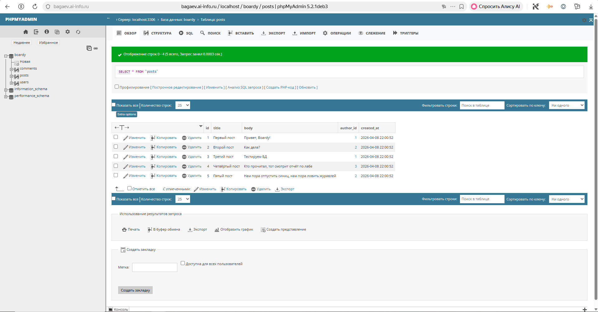
---
Задание 7. SELECT + JOIN

зачем JOIN? Как получить имя автора без него?
JOIN нужен чтобы отобразить данные из разных таблиц
(SELECT name FROM users WHERE id = posts.author_id) AS author - можно так,  но по сути тоже самое

Скриншоты:

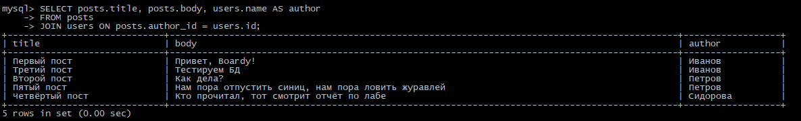
---
Задание 8. Foreign Key — защита целостности

Скриншоты:

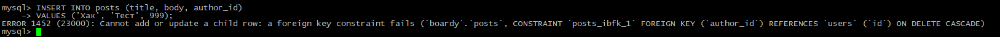
---
Задание 9. CASCADE
Удалите пользователя. Покажите что его посты и комменты удалились.

Скриншоты:

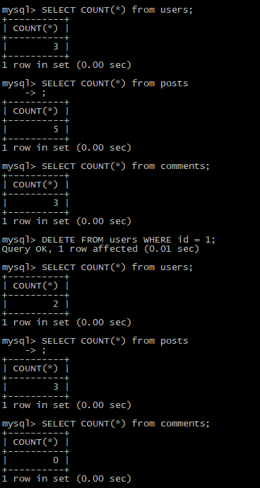

---
Задание 10. SQL-инъекция

как работает SQL-инъекция? Как prepared statement защищает?
SQL инъекция - вставка пользователем своих SQL команд, возможна, когда данные введённые пользователем, напрямую вставляются в SQL запрос
Prepared statement указывает места, где должны быть данные введённые пользователем и сервер знает, что это не часть команды

Скриншоты:

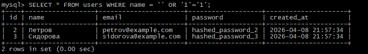

---
Задание 11. db.php
Создайте db.php с PDO-подключением (charset=utf8mb4).

Скриншоты:

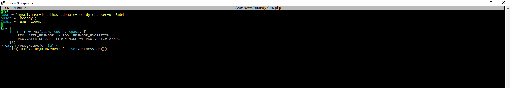

---
Задание 12. submit.php через MySQL
Перепишите submit.php: INSERT через prepared statement.

Скриншоты:

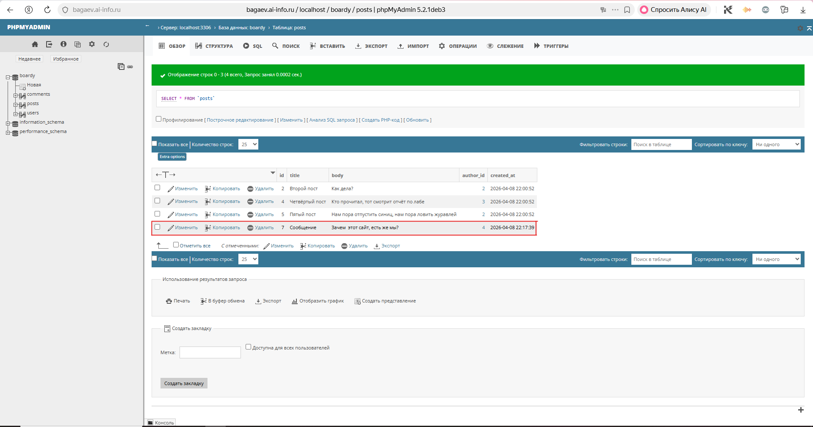

---
Задание 13. messages.php через MySQL
Перепишите messages.php: SELECT JOIN вместо file().

Скриншоты:

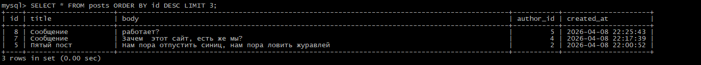

---
Задание 14. aiomysql
Установите aiomysql. Обновите main.py: /api/messages и /api/users читают из MySQL.

почему aiomysql, а не обычный mysql-connector? Что будет с event loop при синхронном драйвере?
Потому что await — не блокирует event loop при запросе к БД. Синхронный драйвер (mysql-connector) заблокировал бы.

Скриншоты:

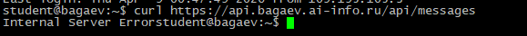
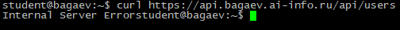

---
Сдача через Pull Request

Скриншоты:

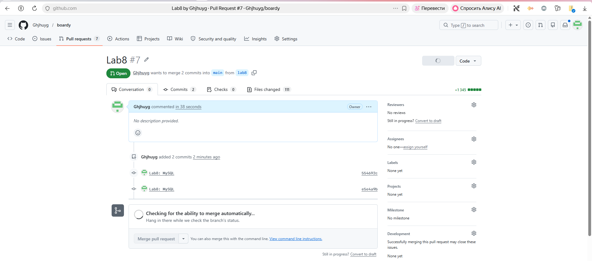