Задание 1. Структура проекта
Создайте database.py и routers/comments.py. Адаптируйте кирпичики под свой проект.

Скриншоты:

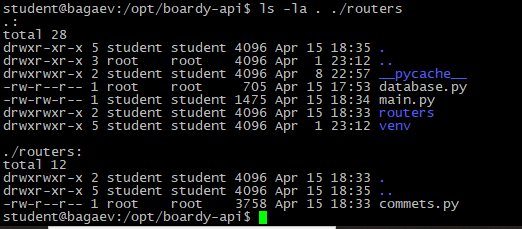
---
Задание 2. GET — список комментариев

какой SQL-запрос выполняет этот эндпоинт? Зачем JOIN?
SELECT c.id, c.body, c.created_at, u.name AS author_name
FROM comments c
JOIN users u ON c.author_id = u.id
WHERE c.post_id = post_id
ORDER BY c.created_at
JOIN нужен, чтобы в таблице было имя пользователя, т.к. в таблице comments есть только id пользователя.

P.S У меня удален первый пост и первый автор, поэтому здесь и далее указаны 2 пост и 2 автор
Скриншоты:

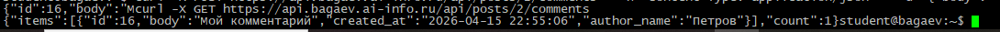
---
Задание 3. POST — создать комментарий

почему 201, а не 200? Что означает Content-Type: application/json?
201 - это именно статус успешного создания, а не просто успешного запроса как 200.
Content-Type: application/json - формат ответа json, была бы страница - был бы html.

Скриншоты:

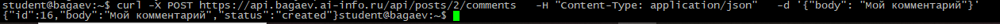
---
Задание 4. PUT — редактировать

чем PUT отличается от POST? Почему URL другой (/comments/{id}, а не /posts/{id}/comments)?
PUT - для изменения существующего, POST - для создания нового. URL другой, потомучто в PUT мы меняем
комментарий с конретным id, а в POST - мы создаем новый комментарий к посту с конкретным id.

Скриншоты:

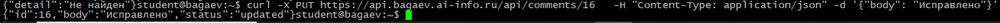
---
Задание 5. DELETE — удалить

перечислите 4 HTTP-глагола. Какой код ответа у каждого и почему?
GET - 200 - стандартный статус успешного запроса, а GET - именно запрос данных
POST - 201 - статус успешного создания нового объекта, а POST - именно создание нового объекта
PUT - 200 - стандартный статус успешного запроса, хоть PUT и меняет данные, но и не создаёт ничего нового + тело ответа не пустое
DELETE - 204 - статус успешного выполнения запроса, но указывает, что тело ответа пустое

Скриншоты:

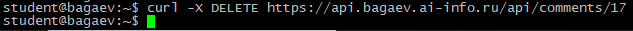
---
Задание 6. Ошибки
Получите ошибки 404 (несуществующий комментарий) и 422 (пустой текст).

чем 404 отличается от 422?
404 - нет такого адреса
422 - адрес есть, но тело запроса неправильное

Скриншоты:

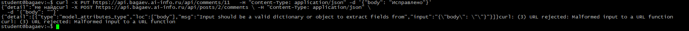
---
Задание 7. Swagger
Откройте .../docs. Выполните POST через Swagger.

Скриншоты:

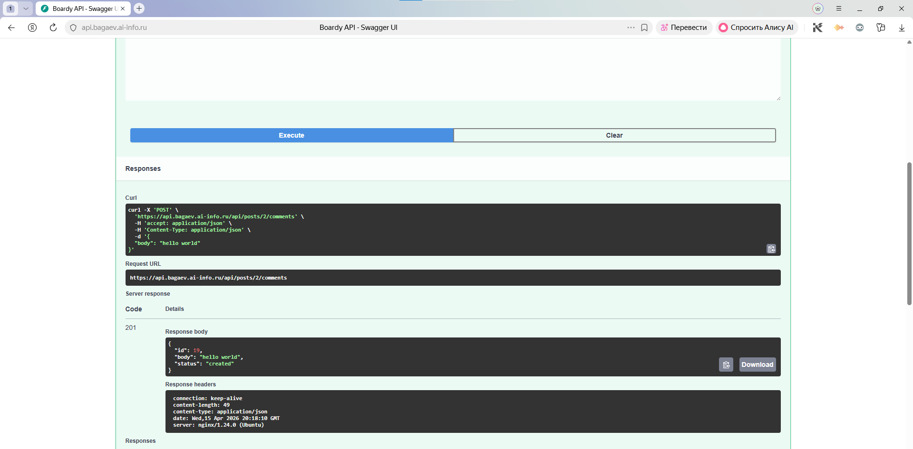
---
Задание 8. Vanilla JS — демо
Адаптируйте кирпичики 7–9 под свой проект. Откройте comments-demo.html.

что делает функция esc()? Что случится если её не вызвать?
преобразует символы HTML так, чтобы они были именно текстом, а не считывались как часть кода страницы (по-сути защита от HTML-инъекций, если так можно сказать)

Скриншоты:

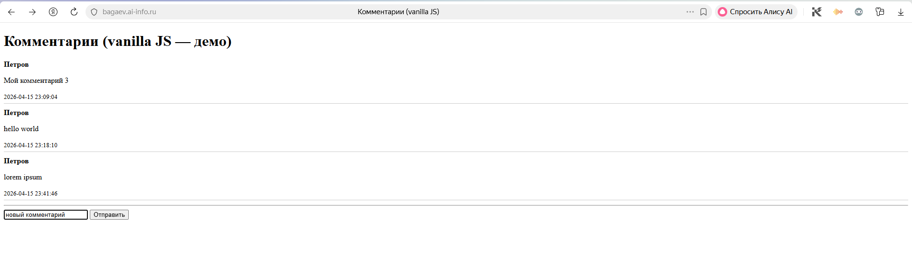
---
Задание 9. React — полный CRUD
Адаптируйте кирпичики 10–13. Откройте comments.html.

Скриншоты:

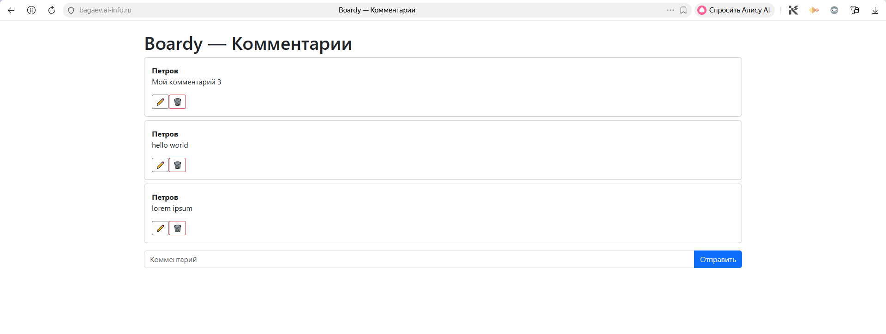
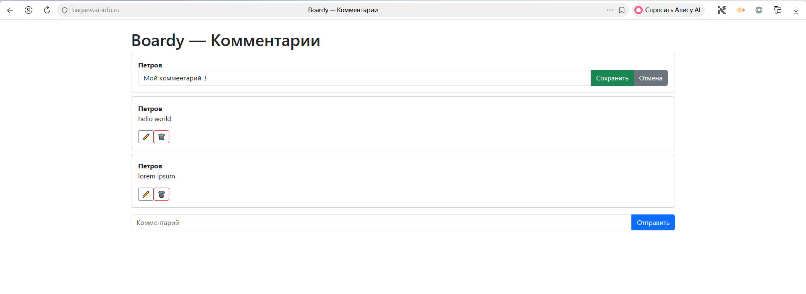
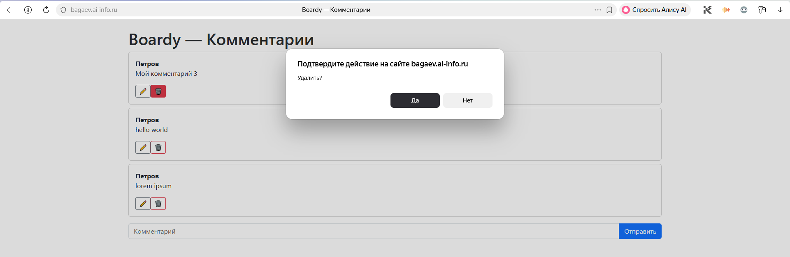
---
Задание 10. Сравнение кода

В отчёте: сравните vanilla JS и React по пунктам:
— Где хранится состояние (список комментариев, текст формы)?
vanilla JS - не хранится, React - в хуке useState
— Как обновляется список после добавления?
vanilla JS - вся страница перерисовывается целиком, React - только изменившийся кусок
— Как реализовано редактирование?
vanilla JS - перестраивает весь DOM при каждом действии, React - перерисовывает только нужный блок
— Как защищаемся от XSS?
vanilla JS - с помощью функции esc() (экранирует символы), React - автоматически экранирует весь item.body

Скриншоты:

---
Задание 11. DevTools → Network
comments.html → DevTools → Network → перезагрузите.

сколько запросов? Какой из них — к API?
6 запросов, самый нижний - к api

Скриншоты:

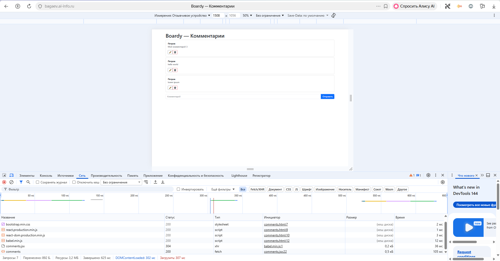
---
Задание 12. View Source
messages.php и comments.html — View Source.

почему в CSR нет данных в исходнике? Что увидит поисковый бот?
потому что они загружаются после выполнения скрипта, бот не увидит комментарии, он увидит 
Загрузка...

Скриншоты:

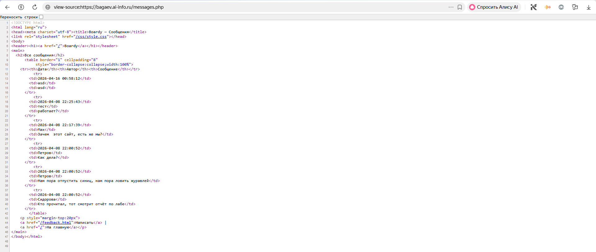
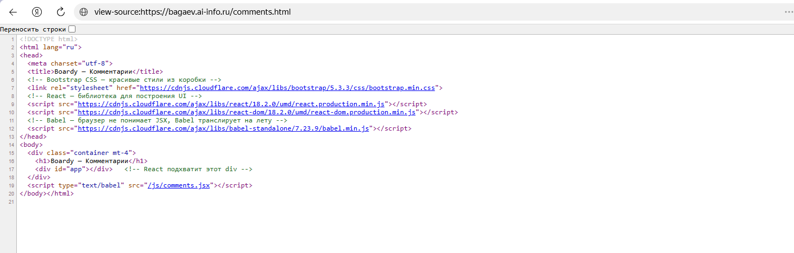
---
Задание 13. XSS
Создайте комментарий: 
Проверьте на comments-demo.html и comments.html.

как vanilla JS и React защищаются от XSS? Какой способ надёжнее?
vanilla JS - разработчик сам должен вызвать функцию esc(), экранирует специальные символы, React - экранируется все автоматически, безопаснее, конечно, React, т.к. исключает человеческий фактор

Скриншоты:

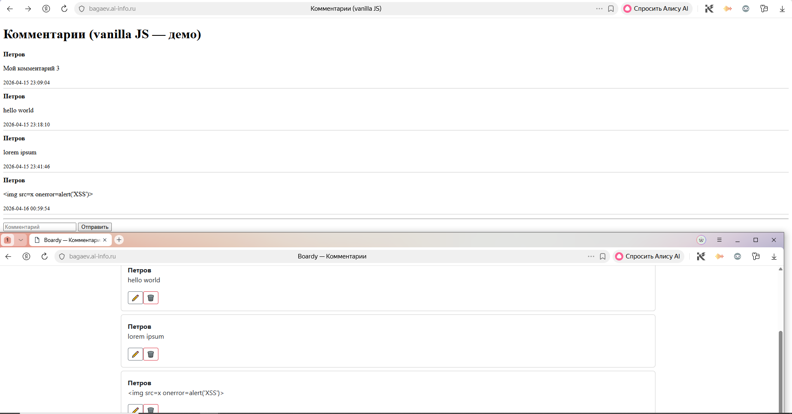

---
Задание 14. Итоговая таблица
Заполните в отчёте:

	                       SSR (PHP)	vanilla JS	             React
Кто рендерит HTML	        Сервер            Клиент                     Клиент 
Формат ответа сервера	         HTML 	 HTML-скелет + JavaScript  HTML-скелет + JavaScript
View Source: данные видны?	  Да	            Нет	                      Нет
Перезагрузка при отправке	  Да	            Нет	                      Нет
Защита от XSS	               Вручную	       Автоматически	         Автоматически
Сложность кода (1-легко)          3      	     2	                       1